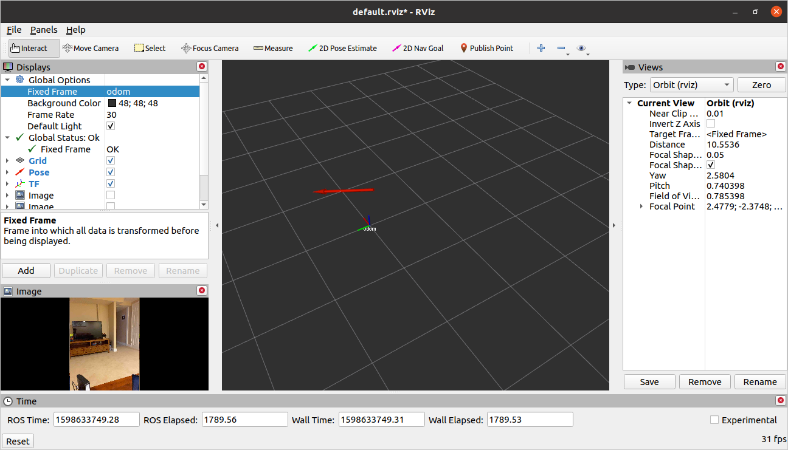

In addition to simulators, we'll be making heavy use of datasets in this class. In contrast to simulators, datasets will typically involve recordings of sensor data and motor commands from real robots.  As such, datasets will be great for testing out perception algorithms (e.g., robot localization, computer vision), but not so good for testing out control algorithms (since we can't command our robot to do anything different than it did when the dataset was recorded).

## Augmented Reality Dataset

Modern mobile phones have some pretty sophisticated abilities.  One of them is Augmented Reality.  We have a toolset to use mobile phones as a method for streaming data into ROS.  The dataset contains the position in the scene (as determined by ARKit) along with the images.  Also included are the positions of special augmented reality tags detected in the environment.

Here is a list of the bag files we have collected.
* [Paul Basement: Run 1](../data/arkit_sample.bag)

If you play this bag file back and visualize the data in ROS, you will see the following results.

* TODO: full instructions on how to do this.
* TODO: images seem to be broken.

