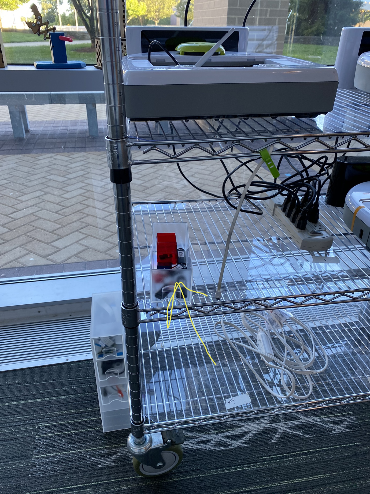

The teaching team will be using ROS2 Jazzy with Ubuntu 24.04, and we recommend you do the same.

> While there are other ways to install ROS on a computer (ROS2 for Windows, ROS2 through Docker, ROS2 through Windows Subsystem for Linux, ROS1), you really, really want to use Ubuntu running via dual boot (not as a virtual machine).  We have found that while these other setups work to varying degrees, there are always little issues that will crop up that will likely get in the way of your learning.  While setting up a dual boot takes some time, you will find that the payoff is quite big (both in terms of the smoothness of your experience and in learning how to interact with a Linux environment).


## Setting up a Dual Boot

How2Shout has [a nice walkthrough of setting up your computer to dual boot](https://linux.how2shout.com/install-ubuntu-22-04-jammy-alongside-windows-10-dual-boot/).  Before doing this you'll want to have a Ubuntu 24.04 installer handy.  You can get an installer using the [How2Shout guide on creating a bootable installer](https://linux.how2shout.com/how-to-create-ubuntu-22-04-bootable-usb-drive-on-windows) or by using one of the thumb drives we have created for you to use.  Look for them on the Neato rack.  Here is a photo that shows the location of the thumb drives!

<p align="center">

</p>

A few quick notes:
* If you have an older version of Ubuntu, you may be able to upgrade it.  That said, I have seen cases where this upgrade process has yielded a broken installation.  Here are some [instructions on upgrading](https://ubuntu.com/server/docs/upgrade-introduction) from the Ubuntu website.
* When installing Ubuntu you will likely need to **shrink your Windows partition** to make room for Ubuntu.  Sometimes this can be accomplished through the Ubuntu installer, if you are not able to shrink your partition in this way, we had success using [EaseUS Partition Manager](https://www.easeus.com/partition-manager/epm-free.html).  If that still doesn't work, send us an e-mail (see below).
* You should probably reserve about 50 GB of space for Ubuntu.
* When installing Ubuntu, you should select the options to **Download updates** and **Install third-party software**.


*Once you have a freshly installed copy of Ubuntu 24.04, perform the next steps on this page.*

### Troubleshooting

In previous years, a student reported an error message about needing to turn off RST to install Ubuntu.  The student was able to find a workaround.  If you have this or any other issue, please send an e-mail to <a href="mailto:vpreston@olin.edu">vpreston@olin.edu</a>.


## Make Sure Your NVIDIA Card is Setup

Depending on how you installed Ubuntu, you may not have the drivers installed for your NVIDIA graphics card.  To check whether you have the NVIDIA drivers installed, you can run the following command in a ```terminal``` window.


```bash
nvidia-smi
```

If you have the drivers installed, you should see output similar to the following.
```bash
Wed Sep 16 13:53:41 2020       
+-----------------------------------------------------------------------------+
| NVIDIA-SMI 440.100      Driver Version: 440.100      CUDA Version: 10.2     |
|-------------------------------+----------------------+----------------------+
| GPU  Name        Persistence-M| Bus-Id        Disp.A | Volatile Uncorr. ECC |
| Fan  Temp  Perf  Pwr:Usage/Cap|         Memory-Usage | GPU-Util  Compute M. |
|===============================+======================+======================|
|   0  GeForce MX150       Off  | 00000000:02:00.0 Off |                  N/A |
| N/A   54C    P0    N/A /  N/A |    316MiB /  2002MiB |      5%      Default |
+-------------------------------+----------------------+----------------------+
                                                                               
+-----------------------------------------------------------------------------+
| Processes:                                                       GPU Memory |
|  GPU       PID   Type   Process name                             Usage      |
|=============================================================================|
|    0      1024      G   /usr/lib/xorg/Xorg                            29MiB |
|    0      1786      G   /usr/lib/xorg/Xorg                           126MiB |
|    0      2019      G   /usr/bin/gnome-shell                         101MiB |
|    0      4581      G   ...AAAAAAAAAAAACAAAAAAAAAA= --shared-files    19MiB |
|    0     78591      G   /opt/zoom/zoom                                24MiB |
|    0     84198      G   /usr/lib/firefox/firefox                       1MiB |
+-----------------------------------------------------------------------------+
```

If you see a message that ``nvidia-smi`` is not installed, you can use [these instructions](https://linuxconfig.org/how-to-install-the-nvidia-drivers-on-ubuntu-22-04) to install it.


## Install ROS Jazzy

Follow [this tutorial](https://docs.ros.org/en/jazzy/Installation/Ubuntu-Install-Debs.html) (make sure to install ``ros-jazzy-desktop`` rather than ``ros-jazzy-ros-base``).  Once you get to the section ``Environment Setup'', you can come back to this document (don't follow those instructions in the tutorial).

In addition to the ``ros-jazzy-desktop`` package, you should install these additional packages to allow you to stream video from the Neatos and interact with the Neato simulator.


```bash
sudo apt-get update && sudo apt-get install -y ros-jazzy-gazebo-ros-pkgs \
	ros-jazzy-nav2-bringup \
	ros-jazzy-navigation2 \
	ros-jazzy-camera-info-manager \
	ros-jazzy-cartographer-ros \
	ros-jazzy-cartographer \
	ros-jazzy-gscam \
	git \
	python3-colcon-common-extensions \
	gstreamer1.0-plugins-good \
	gstreamer1.0-plugins-bad \
	gstreamer1.0-plugins-ugly \
	gstreamer1.0-libav gstreamer1.0-tools \
	gstreamer1.0-x \
	gstreamer1.0-alsa \
	gstreamer1.0-gl \
	gstreamer1.0-gtk3 \
	gstreamer1.0-qt5 \
	gstreamer1.0-pulseaudio \
	python3-pip \
	hping3
```

## Setup your Workspace with the Neato Packages

Next, you'll be creating a workspace, downloading the packages required to connect to the Neato, and building those packages.  You'll be learning more about what's going on in these steps later in the course, but if you are curious see [this ROS tutorial](https://docs.ros.org/en/jazzy/Tutorials/Beginner-Client-Libraries/Colcon-Tutorial.html).  Note: if you are trying to run this in a VM with an Apple Silicon Mac, you can try (again, not supported officially) the steps below but replace the line where you checkout the ``neato_packages`` with ``git clone -b no_gazebo https://github.com/comprobo24/neato_packages``.


```bash
source /opt/ros/jazzy/setup.bash
mkdir -p ~/ros2_ws/src
cd ~/ros2_ws/src
git clone https://github.com/comprobo24/neato_packages
cd ~/ros2_ws
colcon build --symlink-install
source ~/ros2_ws/install/setup.bash
```

You will probably get a warning when you execute this build that looks like this.
```bash
--- stderr: neato_node2                   
/usr/lib/python3/dist-packages/setuptools/command/easy_install.py:158: EasyInstallDeprecationWarning: easy_install command is deprecated. Use build and pip and other standards-based tools.
  warnings.warn(
---
```

This warning is benign and is [known to the ROS2 developers](https://github.com/ros2/ros2/issues/1362).

Edit your ``~/.bashrc`` file so that your workspace is correctly loaded whenever you start a new terminal (note: if you are using a different shell, you may have to adjust this).


```bash
echo "source /opt/ros/jazzy/setup.bash" >> ~/.bashrc
echo "source ~/ros2_ws/install/setup.bash" >> ~/.bashrc
```

### Set your ROS_DOMAIN_ID

ROS2 uses the environment variable ``ROS_DOMAIN_ID`` as a way to isolate various ROS2 environments.  Each student will have their own ROS_DOMAIN_ID assigned to them so that there is no cross talk between computers.  [Check on Canvas for your domain ID](https://olin.instructure.com/courses/592/pages/ros2-domain-ids) and add it to your ``.bashrc`` file using the following command.


```bash
echo "export ROS_DOMAIN_ID=put-your-domain-id-here" >> ~/.bashrc
```

### Installing OpenCV and Streaming Support

Make sure you have installed ``pip3`` (this can be done through ``apt-get`` as shown earlier).

Install ``Sckit-Build`` and ``OpenCV``.


```bash
pip3 install scikit-build
pip3 install opencv-python
```

Make sure ``hping3`` is setup so you can stream video from the robot.

```bash
sudo setcap cap_net_raw+ep /usr/sbin/hping3
```

## Working with VSCode (Optional)

I'll be using VSCode when doing demonstrations in class.  If you'd like to use VSCode, you can use the [VSCode Ubuntu install instructions](https://code.visualstudio.com/docs/setup/linux) and then go through the steps in [Configure VS Code for ROS2](https://www.youtube.com/watch?v=hf76VY0a5Fk).

There is documentation on running [ROS code in the debugger under VSCode](https://github.com/ms-iot/vscode-ros/blob/master/doc/debug-support.md), but you might have better luck using the default Python debugging profile.
