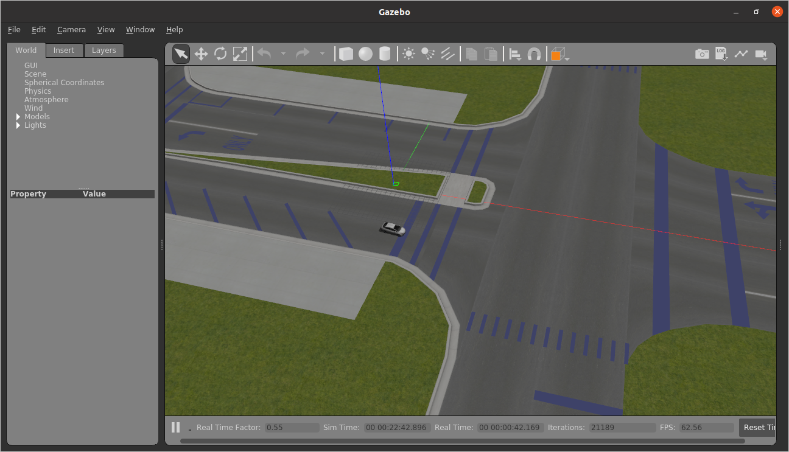
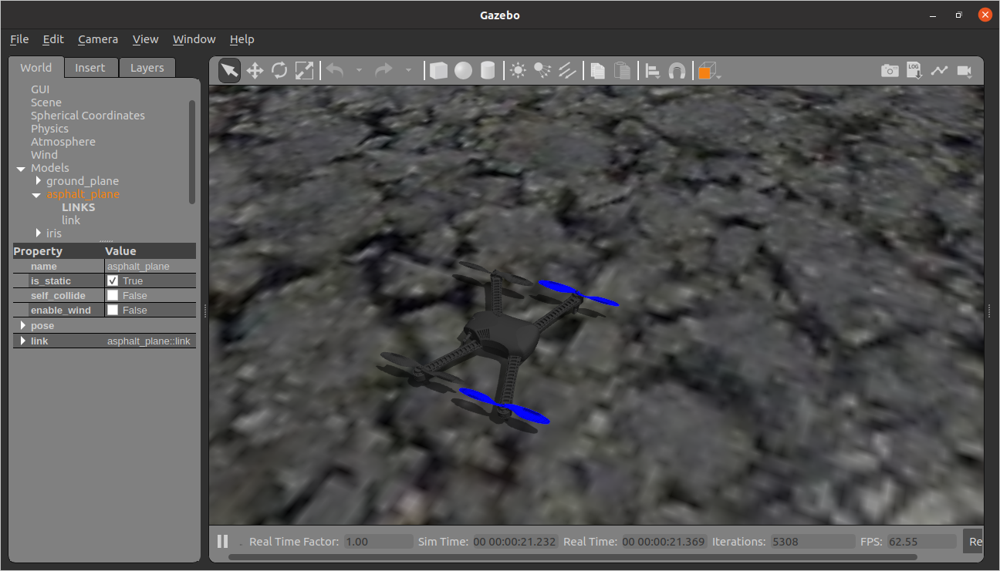
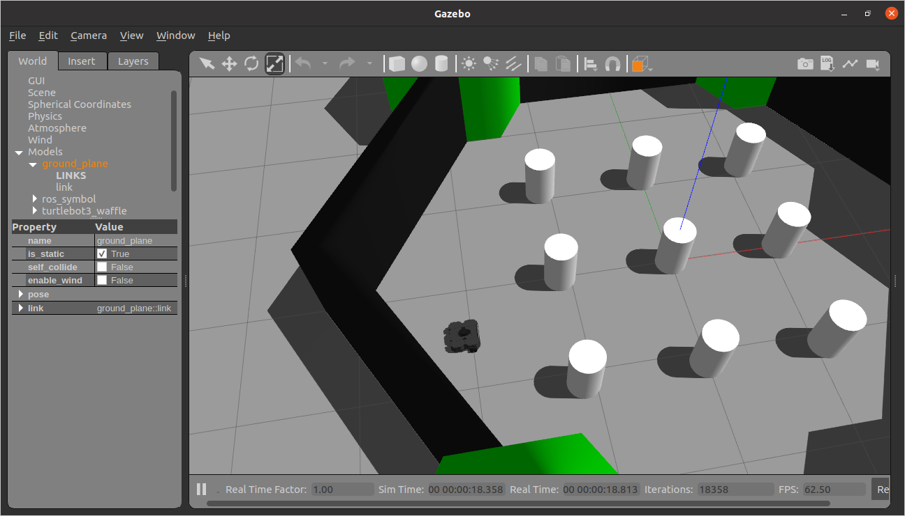
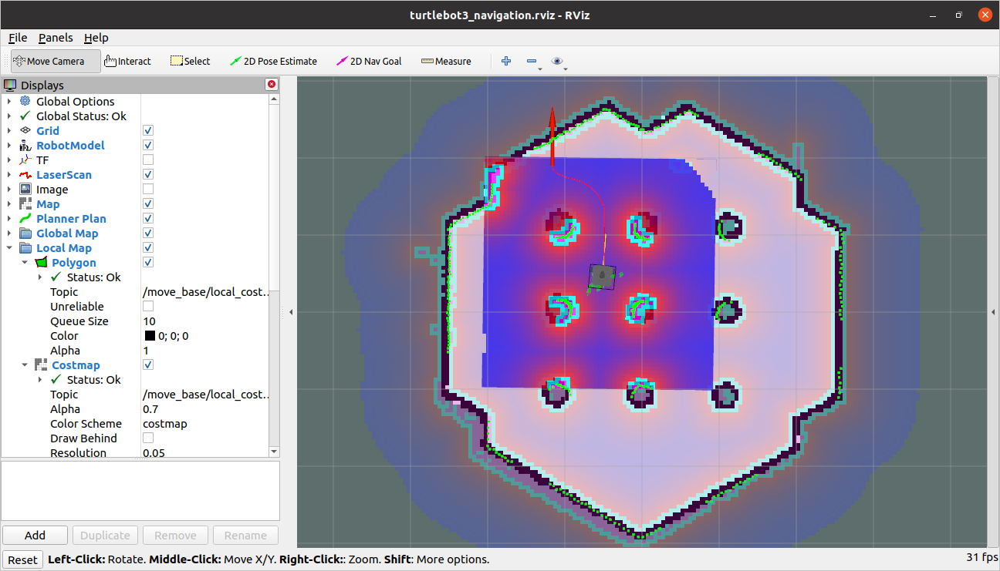
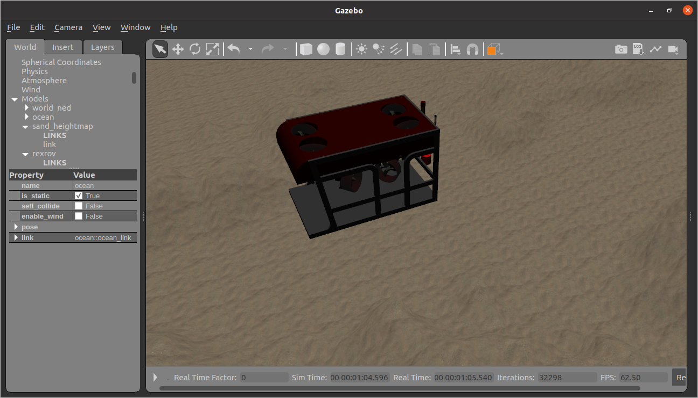

In the beginning of the class you'll be mainly working wth <a-no-proxy data-canvas="https://olin.instructure.com/courses/143/modules/items/1305" href="../How to/run_the_neato_simulator">the Neato simulator</a-no-proxy>.  However, there will be lots of opportunities to use other simulators for other projects.  The simulators on this page, at least currently, are provided as starting points for your own investigation.  They are not fully built out tutorials (in the way that the Neato simulator is).  By working together (with you all), we hope that we can improve the level of detail on this page and add additional simulators.

## Prius Simulator
The Open Source Robotics Foundation (OSRF) put together a demo of a Prius that can be controlled through ROS.  Notably,
the car is outfitted with many sensors that resemble what you'd find on an autonomous car (e.g., 3D lidar, many cameras).
An overview of the demo is available on [this blog post](https://www.osrfoundation.org/simulated-car-demo/).

We got the demo running and collected a few screenshots.  First, this is what the view of the Prius looks like through Gazebo.



Second, here is a visualization of the car's sensor data through rviz.


### Setting up the Simulator Prerequisites

This one is a bit involved, but we did get it to work successfully.

#### Get the Code
First, clone the [car_demo](https://github.com/osrf/car_demo) repository.  Avoid cloning it under your `catkin_ws` directory as it will interfere with
running `catkin_make`.

#### Get Docker

Getting the demo running is fairly involved since this demo has not been updated for ROS Noetic (or even ROS Melodic for that matter).  To get around
this the authors of the demo have included a procedure to build and run the demo through Docker.  As a firs step, you should install Docker and perform the post-install steps for Linux.  The relevant instructions can be found on the Docker website under [install using the repository](https://docs.docker.com/engine/install/ubuntu/#install-using-the-repository).

Once you've installed Docker, you'll want to setup docker so you can run it as a non-root user.  TO do this you need to perform the following steps.

```bash
$ sudo groupadd docker 
$ sudo usermod -aG docker $USER
$ newgrp docker
```

To verify that everything is working, run the following command.
```bash
docker run hello-world
```

If everything is good to go, you should see output that resembles the following.
```bash
Unable to find image 'hello-world:latest' locally
latest: Pulling from library/hello-world
0e03bdcc26d7: Pull complete 
Digest: sha256:7f0a9f93b4aa3022c3a4c147a449bf11e0941a1fd0bf4a8e6c9408b2600777c5
Status: Downloaded newer image for hello-world:latest

Hello from Docker!
This message shows that your installation appears to be working correctly.

To generate this message, Docker took the following steps:
 1. The Docker client contacted the Docker daemon.
 2. The Docker daemon pulled the "hello-world" image from the Docker Hub.
    (amd64)
 3. The Docker daemon created a new container from that image which runs the
    executable that produces the output you are currently reading.
 4. The Docker daemon streamed that output to the Docker client, which sent it
    to your terminal.

To try something more ambitious, you can run an Ubuntu container with:
 $ docker run -it ubuntu bash

Share images, automate workflows, and more with a free Docker ID:
 https://hub.docker.com/

For more examples and ideas, visit:
 https://docs.docker.com/get-started/
```

#### Install NVIDIA Container Toolkit

Get Docker setup to work with your NVIDIA GPU (assuming you are using your Olin laptop you should have one).  To get it working, run the following commands ([link to the original instructions](https://github.com/NVIDIA/nvidia-docker))
```bash
# Add the package repositories
distribution=$(. /etc/os-release;echo $ID$VERSION_ID)
curl -s -L https://nvidia.github.io/nvidia-docker/gpgkey | sudo apt-key add -
curl -s -L https://nvidia.github.io/nvidia-docker/$distribution/nvidia-docker.list | sudo tee /etc/apt/sources.list.d/nvidia-docker.list

sudo apt-get update && sudo apt-get install -y nvidia-container-toolkit
sudo systemctl restart docker
```

#### Install Rocker

Rocker is a tool to streamline running Docker containers with 3D and GUI support.  You can install it using ``pip``.

```bash
$ pip3 install rocker
```

### Building the Simulator

Navigate to the directory where you clone ``car_demo`` and run the following command.

```bash
./build_demo.sh
```

If everything worked, you'll see the following output at end of running the command.
```bash
Successfully built 00dd0ec5e7c8
Successfully tagged osrf/car_demo:latest
```

### Running the Simulator

Run the following command to start the simulator.

```bash
$ rocker --nvidia --x11 --network host  --devices /dev/input/js0 /dev/input/js1 -- osrf/car_demo
```

If all is working, you should see an ``rviz`` window and ``gazebo`` window pop up that look similar to the screenshots earlier int his document.

### Controlling the Prius

We haven't done too much examination of this, but to get the car driving forward, run the following command.

```bash
$ rostopic pub /prius prius_msgs/Control "header:
  seq: 0
  stamp: {secs: 0, nsecs: 0}
  frame_id: ''
throttle: 2.0
brake: 0.0
steer: 0.0
shift_gears: 0" 
```

You should see the car moving in the Gazebo window.

If you find out more cool stuff through your own explorations of this simualator, please let us know (or leave an annotation here).

## PX4 Simulator

If you want to do simulation of aerial vehicles (and some land-based vehicles as well), you can make use of the very powerful PX4 simulator.  Here is a video of one of the simulations in action.

<iframe width="560" height="315" src="https://www.youtube.com/embed/qfFF9-0k4KA" frameborder="0" allow="accelerometer; autoplay; encrypted-media; gyroscope; picture-in-picture" allowfullscreen></iframe>

### Running the Simulator

The full documentation of how to work with the simulator can be found on [the PX4 page](https://dev.px4.io/v1.9.0/en/simulation/gazebo.html).  YOu can think of these instructions as a quickstart.

```bash
$ cd ~
$ python3 -m pip install jinja2 toml
$ git clone https://github.com/PX4/Firmware
$ cd ~/Firmware
$ make px4_sitl gazebo
```

If you run into any issue with running ``make``, please e-mail us.  There may be some issues with missing dependencies that we haven't documented here.

If all went well, you should see a Gazebo window pop up that looks like this.



### Taking Off

In the same window in which you launched the simulator, hit ``[enter]`` a couple of times.  This should bring up a command prmopt that looks like this.

```bash
pxh> 
```

At that command prompt you can run the following command to have the vehicle takeoff.

```bash
pxh> commander takeoff
```

If all goes well, you should see the vehicle taking off in the Gazebo window.

### Controlling the Vehicle

We haven't looked into this in too much detail, so we will leave it to the class (at least at the moment) to figure out how this might work.  [The documentation for PX4](https://dev.px4.io/v1.9.0/en/) should get you going, but please keep us in the loop if you run into issues.
Also, please share what you learn with the class (or with us and we'll add it to this page).

## TurtleBot3 Simulator

TurtleBot is a nice platform for learning ROS.  [TurtleBot3](https://emanual.robotis.com/docs/en/platform/turtlebot3/overview/) is the latest incarnation.  As of writing this document, there are currently no binary packages for TurtleBot3 for ROS Noetic.  As such, you'll have to build it from source using the following procedure.

### Setting up the Simulator

```bash
$ sudo apt-get install ros-noetic-turtlebot3-msgs
$ cd ~/catkin_ws/src/
$ git clone https://github.com/ROBOTIS-GIT/turtlebot3_simulations.git
$ git clone https://github.com/ROBOTIS-GIT/turtlebot3
$ cd ~/catkin_ws && catkin_make
```

### Running the Simulator

To run the simulator, you'll first need to pick which variant of the Turtlebot3 you want to simulate.  The choices are burger, waffle, and waffle_pi .  These are what they look like.


Let's suppose we decide to simulate the ``waffle`` model (this one is the fanciest!).  We can run the simulator with the following command.

```bash
$ TURTLEBOT3_MODEL=waffle roslaunch turtlebot3_gazebo turtlebot3_world.launch
```

You should see the Gazebo window pop up, and it should look something like this.



### Controlling the TurtleBot

To control the bot using tele-operation, use the following command (detailed instructions are shown when the node pops up).

```bash
$ TURTLEBOT3_MODEL=waffle roslaunch turtlebot3_teleop turtlebot3_teleop_key.launch
```

### Navigating the TurtleBot3 in Rviz

TurtleBot3 provides some launch files as a part of its navigation stack that simplify getting rviz running with the robot.  To access these and try commanding the robot to go to a particular location, run the following commands.

```bash
$ sudo apt-get install ros-noetic-move-base ros-noetic-map-server ros-noetic-amcl ros-noetic-dwa-local-planner
$ roslaunch turtlebot3_navigation turtlebot3_navigation.launch
```

This will bring up Rviz and show you the robot's sensor data.  To get the robot to navigate, follow the instructions on the [TurtleBot3 Navigation Documentation page](https://emanual.robotis.com/docs/en/platform/turtlebot3/navigation/).  Here is a screenshot of the Turtlbot executing a navigation plan.

 

## Underwater Vehicle Simulator (UUV)
This is a simulator of a submarine-like vehicle.

### Getting the Simulator

***Note 1:*** if you are using Melodic, you can install this from a binary package using the [instructions on the UUV website](https://uuvsimulator.github.io/installation/).

***Note 2:*** We are currently having you build this from our own fork of the UUV repository.  The reason for this is that the main repository does not properly support ROS Noetic and Gazebo 11.

```bash
$ cd ~/catkin_ws/src
$ git clone https://github.com/comprobo20/uuv_simulator
$ cd ~/catkin_ws && catkin_make
```

### Running the Simulator

Instructions on running the simulator can be found on the [quickstart page](https://uuvsimulator.github.io/quick_start/) of the documentation.  Unfortunately, the instructions to drive the vehicle around involve using a joystick (which most people, including us, don't have).  Let us know if you figure out how to do it with the keyboard (we didn't investigate this yet).

For example, you can run these commands.
```bash
$ roslaunch uuv_gazebo_worlds ocean_waves.launch
$ roslaunch uuv_descriptions upload_rexrov.launch mode:=default x:=0 y:=0 z:=-20 namespace:=rexrov
```

If all goes well you should see the underwater vehicle (it might takea w hile to find it, but the Gazebo GUI, ``follow`` mode can help).



