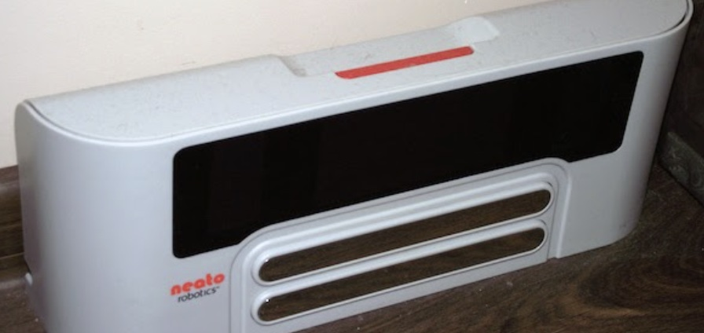
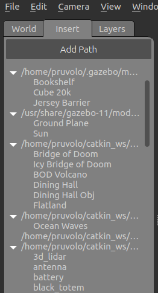
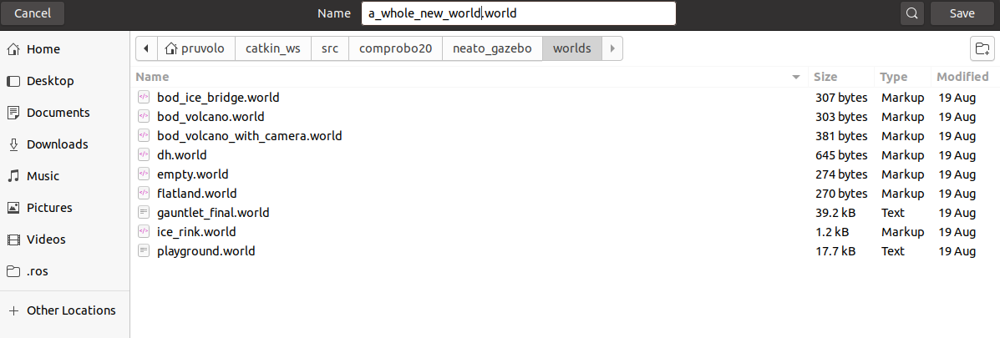

This document will help use the Neato robots and use a simulated Neato (really a [Turtlebot3](https://emanual.robotis.com/docs/en/platform/turtlebot3/overview/)).  Before going through these instructions, make sure that you have already <a-no-proxy href="../How to/setup_your_environment" data-canvas="https://olin.instructure.com/courses/143/modules/items/1303">setup your computing environment</a-no-proxy>.


# Connecting to the Physical Neatos

This semester marks the triumphant return of the physical Neatos to CompRobo!  The last time we used these was Fall 2018.  I've spent a lot of time getting these old trusty bots ready for the semester, but please be patient while we work out any remaining kinks.  We'll also be getting a [TurtleBot4 Lite](https://www.robotshop.com/en/clearpath-robotics-turtlebot-4-lite-mobile-robot.html) in the first couple of weeks of the semester if you'd like to play around with that.


## Normal Usage

### Step 1: Find a Neato!

The Neatos will be stored in or just outside the classroom (MAC126).  There are two types of Neatos: the [Botvac series](https://neatorobotics.cn/wp-content/themes/neato-2015/assets/images/robot-vacuums/botvac-d75/botvac-d75_medium.jpg) and the [XV series](https://c1.neweggimages.com/ProductImage/96-399-007-13.jpg). There is really no difference between the two, so feel free to grab either type of robots.

Note: Both of these types of robots are pretty much identical, however, please be careful when putting your robot away as there are two different types of charging docks for these robots.   Before choosing your robot check its battery level.

Checklist:

1. Make sure the Neato's batteries are charged.  To test this, pull the Neato away from it's charging station and hit the big button next to the Neato's display (the button looks different on the XV versus the BotVac).  The display should turn on and stay on revealing a battery capacity indicator.  Make sure the capacity is close to full.  Sometimes the battery will show low even though it is really charged (I'm still looking into this), so if you can only find one with low charge, consider giving it a shot.

### Step 2: Get a Battery USB Battery Pack for the Raspberry Pi

The batteries are all stored on the racks in the classroom.

Checklist:
1. The battery indicator light should be at least level 2 (preferably full)

### Step 3: Connect the USB battery pack to the Raspberry Pi's USB cable.

It should take about 1 minute for the robot to be ready to use (see step 4 for a final checklist).

<p align="center">

</p>

Checklist:

1. If you are using one of the cables with a small flat connector, make sure it is inserted in the proper direction (yes, it is possible to put it in backwards)

### Step 4: Connecting to the Neato from Your Laptop

Checklist before performing this step:

1. Raspberry pi display backlight is illuminated and not flashing on and off (see troubleshooting section for what to do if this is not the case)
2. Raspberry pi display shows that the Neato is connected to the OLIN-ROBOTICS network and has an IP address asssigned to it
3. Raspberry pi display shows that the signal strength of the Neato's connection is at least 45 (the max is 99 for the wifi adapters with attached antennas and 70 for the ones without).   If the signal strength is very low see troubleshooting section for information on what to do.
4. Your laptop is connected to the OLIN-ROBOTICS.  A good sanity check is to make sure you can ping the robot.  You can run ping from the Ubuntu terminal by typing ping IP_ADDRESS_OF_YOUR_ROBOT (if the connection is working you will see the time for each packet to round trip back to your computer).

In a new terminal, connect to the robot:

```bash
$ ros2 launch neato_node2 bringup.py host:=IP_ADDRESS_OF_YOUR_ROBOT
```

Where IP_ADDRESS_OF_YOUR_ROBOT is the IP address displayed on the raspberry Pi.  To verify that everything is working properly, try the following steps.

### Moving the Neato around

Open the teleop keyboard node.  Instructions on sending various velocity commands are given when by the on-screen terminal output.  The maximum speed of the neato is $$0.3 \frac{m}{s}$$.

```bash
ros2 run teleop_twist_keyboard teleop_twist_keyboard
```

### Viewing Images from the camera

> NOTE: early in the semester, I will not have the cameras installed on all of the robots.  For now, you can skip this.

Startup ```rqt```.

```bash
$ rqt
```

From the "plugins" menu, select the "visualization" submenu, and then choose "image view".  In the drop down list, select the image topic ``camera/image_raw``.

### ROS Topics Available


## Putting the Neato Away

### Step 1: Turn Raspberry Pi Off

To do this, use the buttons on the Raspberry Pi.  First, press down until you see the text "Press select to Shutdown".  Next, press select to shut the Pi down.  Note: the button press detection code is a bit finicky, be persistent!


### Step 2: Wait for the Pi to completely power off, and then disconnect the battery.

This is really important.  If you pull the power to the Pi to soon, the SD card can become corrupted.    As the Pi shutsdown you will see the green light flash as the red light stays on persistently.  At some point you will see the green light flash on and off at regular intervals (about once a second).  Once these flashes are over and you see no more activity for the green LED, the Pi is completely off.  At this point it is safe to pull the USB cable from the battery (do not remove the end of the cable attached to the Pi).

### Step 3: Put Away Your Toys

Place the Neato back in it's charging dock.  Connect the USB battery pack up to the charger.  There are two types of charging docs depending on whether you are using a BotVac or an XV.


<p align="center">

</p>
<p align="center">
<i>The BotVac charger (notice the lip on the bottom)</i>
</p>


<p align="center">

</p>
<p align="center">
<i>The XV charger (no lip on the bottom)</i>
</p>

Checklist:

1. Make sure the two metal connectors on the back of the Neato have made contact with the charging station.
2. Make sure the USB battery is charging (the lights on the battery should turn on momentarily when you plug it in).

## Troubleshooting

### Symptom: Both the red and green LEDs on the raspberry pi are illuminated and not flashing.

Likely cause: the Pi was unable to boot from its SD card.

* Solution 1: the first thing to check is that the Raspberry Pi's SD card is fully inserted into the Raspberry Pi.  See the image below for the location of the SD card.  You will know it is fully inserted if you push on the card and it clicks into place.
* Solution 2: if the card is fully inserted, the SD card may have become corrupted (possibly because some people didn't properly shut down the Raspberry Pi!).  To remedy this, grab an SD card from the green container located in the plastic drawers in AC112.  Put the old SD card in the red container in the same plastic drawer.

### Symptom: the raspberry Pi display's backlight is flashing on and off.

Likely cause: the Pi cannot connect to the robot via the USB cable.

Solution: sometimes the Neato will turn off due to inactivity.  Press the large button near the Neato display to wake it up.  If that doesn't work try unplugging and replugging the USB cable from the raspberry Pi (DO NOT unplug the USB cable from the side connected to the Neato).  If that doesn't work, shutdown and then reboot the Pi.  If none of this works, the robot battery might be dead.  Try recharging the robot.  While the robot is recharging, switch to another robot.

### Symptom: the Wifi signal strength indicator on the Raspberry Pi is below 40 even though you are right near an access point.

Likely cause: The Pi has connected to an access point that is not the closest one (this will sometimes happen).

Solution: Assuming the Pi display is at the screen showing the IP address, press right to enter the network setup menu.  OLIN-ROBOTICS should be highlighted with an asterisk.  Press right again to reconnect the Pi to the Wifi.  If it doesn't work the first time, try one more time.  If it doesn't work then, switch to a new robot.


## Neato ROS Topics

This documentation gives the high-level purpose of each topic.  To explore more, you can use the following command to get more information.

```bash
$ ros2 topic info topic-name
```

If you want to know more about a message you see in the output of ``ros2 topic info`` you can use the following command (note that the ``-r`` flag can be ommitted if you want to the mesasges nested within the top-level message to be expanded).

```bash
$ ros2 interface show msg_package_name/msg/MessageName
```

### ``accel``

This is the linear acceleration of the Neato in units of earth's gravities.
 
### ``bump``

This topic contains four binary outputs corresponding to each of the Neato's four bump sensors.  The individual fields are:

* ``left_front``
* ``left_side``
* ``right_front``
* ``right_side``

### ``cmd_vel``

You publish to this topic to set the robot's velocity.  The ``linear.x`` direction sets forward velocity and ``angular.z`` sets the angular velocity.

### ``odom``

This tells you the robot's position relative to its starting location as estimated by wheel encoders.  You can get this inforation more flexibly through the ROS ``tf2`` module, but this is a relatively easy way to get started.

### ``projected_stable_scan``

This provides the LIDAR measurements (think of these as detected obstsacles or objects from the environment).  In contrast to the ``scan`` topics, these measurements are in the odometry frame (rather than relative to the robot) and are in Caretesian rather than polar coordinates.  There is no need to use this topic, but for some applications it is nice to have.

### ``scan``

These are the measurements of the Neato's LIDAR.  This diagram should help you with the project. It shows the angles for the laser range data coming from the Neato and how it maps onto the Neato's physical layout.

<p align="center">

</p>

The LaserScan message consists of a number of attributes:

```bash
$ ros2 interface show sensor_msgs/msg/LaserScan
# Single scan from a planar laser range-finder #
# If you have another ranging device with different behavior (e.g. a sonar
# array), please find or create a different message, since applications
# will make fairly laser-specific assumptions about this data

std_msgs/Header header # timestamp in the header is the acquisition time of
	builtin_interfaces/Time stamp
		int32 sec
		uint32 nanosec
	string frame_id
                             # the first ray in the scan.
                             #
                             # in frame frame_id, angles are measured around
                             # the positive Z axis (counterclockwise, if Z is up)
                             # with zero angle being forward along the x axis

float32 angle_min            # start angle of the scan [rad]
float32 angle_max            # end angle of the scan [rad]
float32 angle_increment      # angular distance between measurements [rad]

float32 time_increment       # time between measurements [seconds] - if your scanner
                             # is moving, this will be used in interpolating position
                             # of 3d points
float32 scan_time            # time between scans [seconds]

float32 range_min            # minimum range value [m]
float32 range_max            # maximum range value [m]

float32[] ranges             # range data [m]
                             # (Note: values < range_min or > range_max should be discarded)
float32[] intensities        # intensity data [device-specific units].  If your
                             # device does not provide intensities, please leave
                             # the array empty.
```

Most of these attributes you can ignore for the purposes of this assignment. The one that you will really need to dig into is ranges. The ranges attribute provides 361 numbers where each number corresponds to the distance to the closest obstacle as detected by the laser scan at various angles relative to the robot. Each measurement is spaced exactly 1 degree apart. The first measurement corresponds to 0 degrees in the image of the Neato above. As the degrees in the image go up, so to does the index in the ranges array. Where does 361 come from? The last measurement (index 360) is the same as the first (index 0). Why do we do this craziness?!? We have to do this to adhere to some ROS conventions around LaserScan data that will be important later in the class. For now, you can safely ignore the last measurement (index 360).

### ``stable_scan``

This gives the same data as ``scan`` except the timestamp is automatically adjusted to keep the detected points stable in the odometry frame.  This topic is really only need with the physical Neato robot where the precise timing of the LIDAR is not available due to hardware limitations.

### ``tf``

This is provided by the [tf2 module](https://docs.ros.org/en/galactic/Tutorials/Intermediate/Tf2/Introduction-To-Tf2.html) to update the relationhsip between various coordinate systems.  Typically you don't subscribe to it directly but instead use the Python tf module.

### ``tf_static``

This is provided by the [tf2 module](https://docs.ros.org/en/galactic/Tutorials/Intermediate/Tf2/Introduction-To-Tf2.html) to update the relationhsip between various coordinate systems.  Typically you don't subscribe to it directly but instead use the Python tf module.


# Running the Simulator

Here are the instructions for using the robot simulator.  The current plan is to use the simulator for in-class activities.  This decision is based on the amount of chaos that would ensue in such a large class if every group had their own robot.  If we get to the point where the physical robots are working well, we can revisit this idea.

## What is a Robot Simulator?

Without getting into too much detail, a robot simulator that simulates a robot interacting with some sort of environment.  As such, a simulator will typically provide the following major functionality.

* It will provide a means to specify the physical layout of the robot's environment (e.g., the location of obstacles, the physical properties of various surfaces).
* It will provide a means to specify a robot model (e.g., the robot's sensors, actuators, mass, inertia, etc.).
* It will provide simulated sensor data (i.e., what *would* the robot's sensors have reported if the robot were in a particular environment in a particular location).
* It will provide a means to execute simulated motor commands (i.e., it will let you tell the robot to move).
* It will provide a way to visualize the simulation state (e.g., as a graphical rendering).

One nice thing about ROS is that the usage of a publish and subscribe structure provides a very clean separation between the robot itself and code that you will write to program the robot.  For instance, you can write a motor control node that sends commands to the topic ``cmd_vel``.  This program can work with any real or simulated robot so long as it subscribes to the ``cmd_vel`` topic and executes the appropriate motor command in response to the messages it receives (e.g., the motor command might involve moving a real motor or it might involve moving a simulated robot).

### Differences with RViz

Oftentimes students will be confused as to what the difference is between RViz and a robot simulator.  RViz allows you to visualize a robot's sensor data.  As such, RViz has a graphical interface that can look a lot like the graphical interface of the robot simulator.  In contrast, RViz does not have any means to execute a simulated motor command or generate simulated sensor data: it can only display the data that it receives.

## The Neato Simulator

<p align="center">

</p>

We will be using the popular Gazebo software for robot simulation.  Gazebo is a very powerful and customizable simulator that will be especially useful in this online (virtual) version of the course.

## Starting the Simulator

<ol>
<li>Start <tt>roscore</tt>

<p>Got to a terminal and run the following command.</p>


$ roscore

<p>You should see output that look like the following.</p>


... logging to /home/pruvolo/.ros/log/5e5e9c82-e17e-11ea-bd40-4997ac5b185e/roslaunch-ubuntu-114522.log
Checking log directory for disk usage. This may take a while.
Press Ctrl-C to interrupt
Done checking log file disk usage. Usage is <1GB.

started roslaunch server http://ubuntu:40119/
ros_comm version 1.15.8


SUMMARY
========

PARAMETERS
 * /rosdistro: noetic
 * /rosversion: 1.15.8

NODES

auto-starting new master
process[master]: started with pid [114559]
ROS_MASTER_URI=http://ubuntu:11311/

setting /run_id to 5e5e9c82-e17e-11ea-bd40-4997ac5b185e
process[rosout-1]: started with pid [114576]
started core service [/rosout]

</li>
<li>Launch Gazebo
<p>You can launch your robot in many different simulated worlds.  For instance, to launch your robot in a simulated obstacle course, <b><i>in a new terminal</i></b>, run the following command.</p>


$ roslaunch neato_gazebo neato_gauntlet_world.launch


<p>If all went well, you will see a bunch of output stream by and a visualization that looks like the following.</p>


<p>Instead if you want to run your Neato around the Olin dining hall, try the following command.</p>


$ roslaunch neato_gazebo neato_dh.launch


<p>If you want to create your own world, you can put the Neato in an empty world and then follow our instructions for <a href="#populating-the-simulated-world">populating your own world</a>.</p>


$ roslaunch neato_gazebo neato_empty_world.launch


<p><i>Optional:</i> Loading the camera module. If you want to load a simulated video camera on your Neato, you can modify the instructions in the previous step.</p>


$ roslaunch neato_gazebo neato_dh.launch load_camera:=true


<p>This will result in a white box appearing over your Neato (the simulated camera).   You can look at the images using, e.g., <tt>rqt_gui</tt></p>

</li>
</ol>

## Using the Gazebo Graphical Interface

The Gazebo website has a [guide on using Gazebo's graphical interface](http://gazebosim.org/tutorials?cat=guided_b&tut=guided_b2).

## Available Topics

This documentation gives the high-level purpose of each topic.  To explore more, you can use the following command to get more information.

```bash
$ rostopic info topic-name
```

If you want to know more about a message you see in the output of ``rostopic`` you can use the following command (note that the ``-r`` flag can be ommitted if you want to the mesasges nested within the top-level message to be expanded).

```bash
$ rosmsg show msg_package_name/MessageName -r
```

### ``accel``

This is the linear acceleration of the Neato in meters per second squared along each axis of the Neato.  This same information is included in the ``imu`` topic (although there it is nested further).

### ``camera/image_raw``

These are the images coming from the Raspberry Pi camera.

### ``bump``

This topic contains four binary outputs corresponding to each of the Neato's four bump sensors.  In the simulator, all bump sensors are either on or off (no differentiation is made between the bump sensors).

### ``bumper``

This is an internal topic to Gazebo.  If you are curiouts, you can look at the output as you run into something, but you don't need to worry about it in this class.

### ``clock``

This is the simulator clock.  This is useful for executing commands based on elapsed time.  It is preferable to use this clock rather than the wall clock (your computer's system clock) since the simulation might not run at the same rate as realtime.  You don't typically want to subscribe to this topic directly.  Instead, you can access the time through ``rospy`` (see the [ROS tutorials page](http://wiki.ros.org/rospy/Overview/Time) for details).

### ``cmd_vel``

You publish to this topic to set the robot's velocity.  The ``linear.x`` direction sets forward velocity and ``angular.z`` sets the angular velocity.

### ``encoders``

These tell you the linear travel of each wheel (left is the first element of the array and right is the second) since the simulation started.  You do not have to subscribe to this directly, but instead you can use the ``odom`` topic or the ``tf`` module if you are you are just interested in knowing an estimate of where the robot is relative to where it started.

### ``gazebo/link_states``

This is a Gazebo specific topic (see the [Gazebo docs on ROS communication](http://gazebosim.org/tutorials/?tut=ros_comm)). 

### ``gazebo/model_states``

This is a Gazebo specific topic (see the [Gazebo docs on ROS communication](http://gazebosim.org/tutorials/?tut=ros_comm)). 

### ``gazebo/parameter_descriptions``

This is a Gazebo specific topic (see the [Gazebo docs on ROS communication](http://gazebosim.org/tutorials/?tut=ros_comm)). 

### ``gazebo/parameter_updates``

This is a Gazebo specific topic (see the [Gazebo docs on ROS communication](http://gazebosim.org/tutorials/?tut=ros_comm)). 

### ``gazebo/set_link_state``

This is a Gazebo specific topic (see the [Gazebo docs on ROS communication](http://gazebosim.org/tutorials/?tut=ros_comm)). 

### ``gazebo/set_model_state``

This is a Gazebo specific topic (see the [Gazebo docs on ROS communication](http://gazebosim.org/tutorials/?tut=ros_comm)). 

### ``imu``

This is the simulated IMU (intertial measurement unit).  It has linear acceleration and angular velocity.

### ``joint_states``

These tell you the total rotation (in radians) of each wheel.  Note that this is a "ground truth" value, meaning that it is not estimated from sensors but instead comes from Gazebo.  In a scenario with a real robot, you wouldn't have access to this.

### ``odom``

This tells you the robot's position relative to its starting location as estimated by wheel encoders.  You can get this inforation more flexibly through the ROS tf module, but this is a relatively easy way to get started.

### ``projected_stable_scan``

This provides the LIDAR measusrements (think of these as detected obstsacles or objects from the environment).  In contrast to the ``scan`` topics, these measurements are in the odometry frame (rather than relative to the robot) and are in Caretesian rather than polar coordinates.  There is no need to use this topic, but for some applications it is nice to have.

### ``raw_vel``

you publish to this topic set the left and right wheel velocities independently (rather than setting linear and angular velocities).  You can use this is ``cmd_vel`` for controlling the robot, whichever is easier.

### ``rosout``

This is a topic provided by ROS.  See the [ROS docs on ``rosout``](http://wiki.ros.org/rosout)for more information.

### ``rosout_agg``

This is a topic provided by ROS.  See the [ROS docs on ``rosout``](http://wiki.ros.org/rosout)for more information.

### ``scan``

These are the measurements of the Neato's LIDAR.  This diagram should help you with the project. It shows the angles for the laser range data coming from the Neato and how it maps onto the Neato's physical layout.

<p align="center">

</p>

The LaserScan message consists of a number of attributes:

```bash
$ rosmsg show sensor_msgs/LaserScan
std_msgs/Header header
  uint32 seq
  time stamp
  string frame_id
float32 angle_min
float32 angle_max
float32 angle_increment
float32 time_increment
float32 scan_time
float32 range_min
float32 range_max
float32[] ranges
float32[] intensities
```

Most of these attributes you can ignore for the purposes of this assignment. The one that you will really need to dig into is ranges. The ranges attribute provides 361 numbers where each number corresponds to the distance to the closest obstacle as detected by the laser scan at various angles relative to the robot. Each measurement is spaced exactly 1 degree apart. The first measurement corresponds to 0 degrees in the image of the Neato above. As the degrees in the image go up, so to does the index in the ranges array. Where does 361 come from? The last measurement (index 360) is the same as the first (index 0). Why do we do this craziness?!? We have to do this to adhere to some ROS conventions around LaserScan data that will be important later in the class. For now, you can safely ignore the last measurement (index 360).

### ``stable_scan``

This gives the same data as ``scan`` except the timestamp is automatically adjusted to keep the detected points stable in the odometry frame.  This topic is really only need with the physical Neato robot where the precise timing of the LIDAR is not available due to hardware limitations.

### ``tf``

This is provided by the [ROS tf2 module](http://wiki.ros.org/tf2) to update the relationhsip between various coordinate systems.  Typically you don't subscribe to it directly but instead use the Python tf module.

### ``tf_static``

This is provided by the [ROS tf2 module](http://wiki.ros.org/tf2) to update the relationhsip between various coordinate systems.  Typically you don't subscribe to it directly but instead use the Python tf module.

## Using Rviz with the Simulator

Once the simulator is running, to start rviz, run the following command.

```bash
$ rosrun rviz rviz
```

Once you get to rviz, the warmup project has some good instructionns for how to see the robot and its LIDAR.

1. Set the base_frame to ``odom``
2. Add a visualization of the Neato's stabilized laser scan (topic ``scan``).  This is most easily found by using the "By topic" tab.  Make sure to adjust the size of the markers so you can see them easily).
3. Add a visualization of the Neato itself (this can be done by selecting "Robot Model" from the insert menu")
4. Add a visualization of the Neato's camera feed (topic ``camera/image_raw``) (this only applies if you launched the simulation with ``load_camera:=true``)

## Populating the Simulated World

In order to populate the simulated world, you can use the "insert" menu in Gazebo.  This will bring up a list of 3D models that can be inserted into Gazebo.

<p align="center">

</p>

Click on one of these models and you should be able to drag it onto the Gazebo world.

### Saving the World

After you've built the world, you can save it using "file -> save world" from within Gazebo.  You should save the world into the directory ``~/catkin_ws/src/comprobo20/neato_gazebo/worlds`` as shown below.

> Note: you must save your world to the directory specified above.  Also, be sure that your world ends with the ``.world`` extension.

<p align="center">

</p>

### Loading the World

Assuming you performed the steps above to save the world, if you want to reload your world (e.g., you've shutdown Gazebo), you can load your world by running the following command (you should replace "a_whole_new_world" with whatever you named your world when you saved it.  Also note that we omit the file extension ``.world`` in the command below).

```bash
$ roslaunch neato_gazebo neato_world_no_spawn.launch neato_world:=a_whole_new_world
```

### Video Walkthrough


## Some Cool Stuff About Simulators

While real robots are undoubtedly cool, there are some really awesome things you can do with as simulator.

### Move Your Robot Around

Using the "move" tool in Gazebo, you can select your robot and move it around (so much easier than getting up and having to move your robot with your hands, right???).  You can also set the location of your robot by using the rosservice ``gazebo/set_model_state`` (e.g., if you want to set the robot's position in code).  More detail on how to use the "move" tool is available on the [Gazebo user guide](http://gazebosim.org/tutorials?cat=guided_b&tut=guided_b2).

### Reading the Robot State

Oftentimes you may be trying to get your robot to execute a certain behavior.  With a physical robot, you will usually assess success by observing its behavior visually.  In a simulator, you can actually "cheat" and read the robot's true state right from ROS.  For example, if you were trying to get your robot to drive a square, you could compare the intended square to the actual square by reading the robot's state.  The robot's state is available on the ROS topic ``gazebo/model_states``.

## Shutting Down the Simulator

Go to the terminal where you executed **step 2** (launch Gazebo) and hit control-c.
