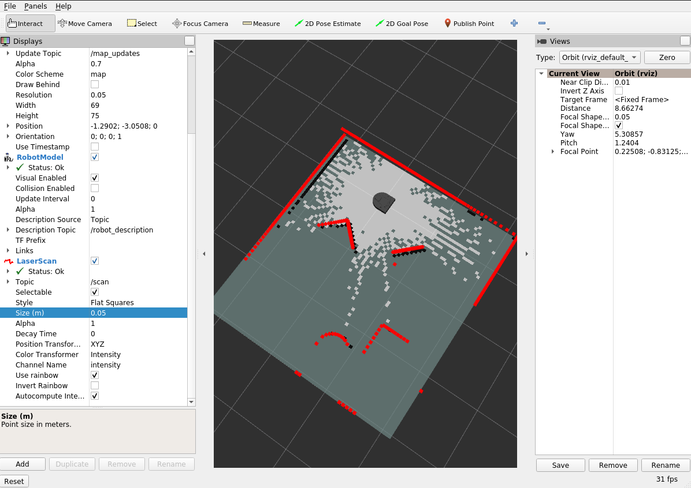
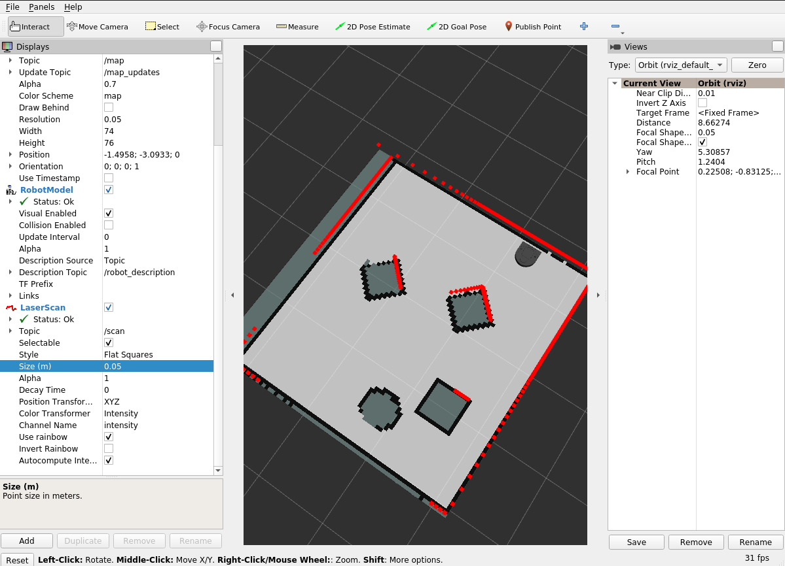

## Abstract

So far, you have successfully programmed robot (simulators) using reactive control strategies. You have also combined these reactive control strategies together using finite state control. Next, you will build on these skills as you continue to explore the field of mobile robotics. In this project you will tackle a fundamental problem in mobile robotics: robot localization.


## Learning Objectives

* Build fluency with ROS
* Learn about one core problem (robot localization) and one important algorithm (particle filtering)
* Learn strategies for developing and debugging algorithms for robotics
* Get a feel for the algorithmic tradeoffs between accuracy and computational efficiency

## Teaming

For this project, you should work with one other student.

## Deliverables

### Implementation Plan

You should come to class with a plan for how you will implement this project.

* Map out the key steps of the particle filter.  You should be able to clearly describe using a combination of words and diagrams each step of the algorithm.  If there are parts that are still a bit fuzzy, make sure you take note of them.
* Map how the key steps show up in the starter code file ``pf.py``.  You should be able to follow the logic in the ``scan_received`` function and understand what's going on there (or have identified questions).
* Propose a testing and implementation plan for your particle filter.  If you are still fuzzy on the details, at least try to map out your first step.
* Decide if you want to use the starter code as is or if you want to reimplement any of it.

It's possible that you will not be able to nail this down in complete detail by this deadline, but you should at least have thought about these issues and made your best attempt.  We will provide feedback on your plan soon after you submit it.

### In-class Presentation / Demo (Due 10-12)

Each team will spend about 5 minutes presenting what they did for this project. Since everyone's doing the same project, there's no need to provide any context as to what the particle filter is or how it works.  I'd like each team to talk about what they did that adds to the overall knowledge of the class.  Examples of this would be non-trivial design decisions you made (and why you made them), development processes that worked particularly well, code architecture, etc.  In addition, you should show a demo of your system in action.

This deliverable be assessed in a binary fashion (did you do the above or not).


### Your Code and Bag Files (Due 10-12)

Your code should be forked from <a href="https://github.com/comprobo22/robot_localization">this repo</a>.  Please push your code to your fork in order to turn it in.

You should include a couple of bag files of your code in action.  Place the bag files in a subdirectory of your ROS package called "bags".  In this folder, create a README file that explains each of the bag files (how they were collected, what you take from the results, etc.).

### Writeup (Due 10-12)

In your ROS package create a ``README.md`` file to hold your project writeup.  Your writeup should touch on the following topics. We expect this writeup to be done in such a way that you are proud to include it as part of your professional portfolio. As such, please make sure to write the report so that it is understandable to an external audience.  Make sure to add pictures to your report, links to Youtube videos, embedded animated Gifs (these can be recorded with the tool ``peek``).


* What was the goal of your project?
* How did you solve the problem? (Note: this doesn't have to be super-detailed, you should try to explain what you did at a high-level so that others in the class could reasonably understand what you did).
* Describe a design decision you had to make when working on your project and what you ultimately did (and why)? These design decisions could be particular choices for how you implemented some part of an algorithm or perhaps a decision regarding which of two external packages to use in your project.
* What if any challenges did you face along the way?
* What would you do to improve your project if you had more time?
* Did you learn any interesting lessons for future robotic programming projects? These could relate to working on robotics projects in teams, working on more open-ended (and longer term) problems, or any other relevant topic.


### Sample Writeups

* <a href="https://github.com/anilpatel38/robot_localization/blob/master/robot_localizer/Anil_Cedric_Localiztion_Report.pdf">Anil Patel and Cedric Kim</a>
* <a href="https://github.com/shootingd/robot_localization">Katya Soltan and Charlie Weiss</a>
* <a href="https://github.com/mary-keenan/robot_localization">Mary Keenan</a>
* <a href="https://github.com/zneb97/robot_localization/blob/master/Robot_Localizer_WriteUp.pdf">Nick Steelman and Ben Ziemann</a>

## Robot Localization and the Particle Filter

For this project you will be programming your robot to answer a question that many of us have pondered ourselves over the course of our lifetimes: "Where am I?". The answer to this question is of fundamental importance to a number of applications in mobile robotics such as mapping and path planning.

For this project, we will assume access to a map of the robot's environment. This map could either be obtained using a mapping algorithm (such as SLAM), derived from building blueprints, or even hand-drawn. Given that we have a map of our environment, we can pose the question of "Where am I?" probabilistically. That is, at each instant in time, t, we will construct a probability distribution over the robot's pose within the map, denoted as $$x_t$$, given the robot's sensory inputs, denoted as $$z_t$$ (in this case Lidar measurements), and the motor commands sent to the robot at time t, $$u_t$$.

The particle filter involves the following steps

1. Initialize a set of particles via random sampling
2. Update the particles using data from odometry
3. Reweight the particles based on their compatibility with the laser scan
4. Resample with replacement a new set of particles with probability proportional to their weights.
5. Update your estimate of the robot's pose given the new particles.  Update the ``map`` to ``odom`` transform.

## Starter Code

### Getting the Robot Localizer Starter Code

The starter code will be in a package called ``robot_localization``.  The <a href="https://github.com/comprobo22/robot_localization"><tt>robot_localization</tt> Github repo</a> you forked is already setup as an appropriate package.

### Installing Supporting Packages

You will need some additional ROS packages that we haven't used thus far.

```bash
$ pip3 install sklearn
$ sudo apt install ros-foxy-nav2-map-server ros-foxy-nav2-amcl ros-foxy-slam-toolbox python3-pykdl
```

### Key Contents of Starter Code

#### ``pf.py``

This file has skeleton of your particle filter (you don't have to build on this if you don't want to).  Check the comments in the file for more details.  This file has pretty much all of the interactions with ROS handled.  You should choose this option if you want to focus on implementing the particle filter algorithm  while minimizing wrangling with ROS infrastructure (you will still have some wrangling no doubt).

> You can also reimplement ``pf.py`` from scratch (or maybe using the starter code as a guide)

#### ``helper_functions.py``

This file has helper functions for dealing with transforms and poses in ROS. Functionality includes converting poses between various formats, computing the ``map`` to ``odom`` transform, and computing angle differences. 

#### ``occupancy_field.py``

This file implements something called an occupancy field (also called a likelihood field).  This structure has the following capability: given a x,y coordinate in the map, it returns the distance to the closest obstacle in the map.  This can be used as a way to compute the closeness of the match the scan data and the map given a hypothesized location of the robot (particle).

You can find an explanation of the likelihood field model in [Pieter Abbeel's slides](https://people.eecs.berkeley.edu/~pabbeel/cs287-fa12/slides/ScanMatching.pdf) (start at page 11).

## A View of the Finish Line and Getting Set with RViz

Before diving into this project, it helps to have a sense of how a successful implementation of the particle filter functions.  You will be creating a map using ROS's built-in mapping system (which you will not be reimplementing) and testing ROS's built-in particle filter (which you will be reimplementing) on the data you collect.  To get started, run the following command.

> Note: we recommend running this with the simulator, but you can try on the real robot.  I have yet to actually give that a shot!

```bash
$ ros2 launch neato2_gazebo neato_gauntlet_world.py
```

Next, start the mapping program.

```bash
$ ros2 launch slam_toolbox online_sync_launch.py
```

Startup ``rviz2``.  You should see all the typical things, but now add a visualization of the ``map`` topic by clicking ``add`` going to the ``by topic`` dialogue and selecting ``map``.

If all went well you will see something like the following.



The representation of the map you see above is called an occupancy grid. The light gray spaces are mapped free space (no obstacle), the black squraes are mapped obstacles, and the dark gray space is unknown.  Drive around for a while until you are able to fill in the dark gray regions.



You can now save the map using the following command (replace ``map_name`` with whatever you want to call the map).

```
ros2 service call /slam_toolbox/save_map slam_toolbox/srv/SaveMap "name:
  data: 'map_name'"
```

Keep rviz running as you'll want it for the next part.  You may also want to save the configuration so you don't have to add the visualizations again the next time you start rviz.

### Running AMCL

Now that you have a map, you will use the built-in particle filter package called AMCL (adaptive monte carlo localization).

Before you start this step here are a few things to do.
1.  Stop the ``slam_toolbox`` nodes you were running from before.  Find the terminal where you ran the ``slam_toolbox online_sync_launch.py`` command and hit ``control-c``.
2.  Make sure ``rviz`` is running and you have added a visualization of the ``map`` topic.
3.  Make sure you know the path to the ``.yaml`` file created when you called the ros service ``save_map``.  Somewhat counterintuitively, the map is saved based on the directory you were in when you launched the ``slam_toolbox``.  Hopefully, that information will help you locate the ``.yaml`` file.  NOTE: when you use this path in the step below, you will need to replace the ``~`` character with the actual path to your home directory, e.g., ``/home/pruvolo``.

To start ``AMCL``, run the following launch file.

```bash
$ ros2 launch robot_localization test_amcl.py map_yaml:=path-to-your-yaml-file
```

Make sure to replace ``path-to-your-yaml-file`` with the path you determined in step (3) of the checklist above.

Once you execute this step, if everything went well you should see output like the following.

```
[INFO] [launch]: All log files can be found below /home/pruvolo/.ros/log/2022-09-22-09-39-47-435007-pruvolo-Precision-3551-77054
[INFO] [launch]: Default logging verbosity is set to INFO
[INFO] [lifecycle_manager-3]: process started with pid [77060]
[INFO] [map_server-1]: process started with pid [77056]
[INFO] [amcl-2]: process started with pid [77058]
[lifecycle_manager-3] [INFO] [1663853987.576642611] [lifecycle_manager]: Creating
[lifecycle_manager-3] [INFO] [1663853987.583821848] [lifecycle_manager]: Creating and initializing lifecycle service clients
[lifecycle_manager-3] [INFO] [1663853987.587494816] [lifecycle_manager]: Starting managed nodes bringup...
[lifecycle_manager-3] [INFO] [1663853987.587568598] [lifecycle_manager]: Configuring map_server
[map_server-1] [INFO] [1663853987.592560333] [map_server]: 
[map_server-1] 	map_server lifecycle node launched. 
[map_server-1] 	Waiting on external lifecycle transitions to activate
[map_server-1] 	See https://design.ros2.org/articles/node_lifecycle.html for more information.
[map_server-1] [INFO] [1663853987.592774423] [map_server]: Creating
[map_server-1] [INFO] [1663853987.593316845] [map_server]: Configuring
[map_server-1] [INFO] [map_io]: Loading yaml file: /home/pruvolo/ros2_ws/src/robot_localization/maps/gauntlet.yaml
[map_server-1] [DEBUG] [map_io]: resolution: 0.05
[map_server-1] [DEBUG] [map_io]: origin[0]: -1.29
[map_server-1] [DEBUG] [map_io]: origin[1]: -3.07
[map_server-1] [DEBUG] [map_io]: origin[2]: 0
[map_server-1] [DEBUG] [map_io]: free_thresh: 0.25
[map_server-1] [DEBUG] [map_io]: occupied_thresh: 0.65
[map_server-1] [DEBUG] [map_io]: mode: trinary
[map_server-1] [DEBUG] [map_io]: negate: 0
[map_server-1] [INFO] [map_io]: Loading image_file: /home/pruvolo/ros2_ws/src/robot_localization/maps/gauntlet.pgm
[map_server-1] [DEBUG] [map_io]: Read map /home/pruvolo/ros2_ws/src/robot_localization/maps/gauntlet.pgm: 70 X 76 map @ 0.05 m/cell
[amcl-2] [INFO] [1663853987.598347033] [amcl]: 
[amcl-2] 	amcl lifecycle node launched. 
[amcl-2] 	Waiting on external lifecycle transitions to activate
[amcl-2] 	See https://design.ros2.org/articles/node_lifecycle.html for more information.
[lifecycle_manager-3] [INFO] [1663853987.598362596] [lifecycle_manager]: Configuring amcl
[amcl-2] [INFO] [1663853987.598468168] [amcl]: Creating
[amcl-2] [INFO] [1663853987.601084411] [amcl]: Configuring
[amcl-2] [INFO] [1663853987.601158005] [amcl]: initTransforms
[amcl-2] [INFO] [1663853987.607943895] [amcl]: initPubSub
[amcl-2] [INFO] [1663853987.611039253] [amcl]: Subscribed to map topic.
[lifecycle_manager-3] [INFO] [1663853987.613411596] [lifecycle_manager]: Activating map_server
[map_server-1] [INFO] [1663853987.613516990] [map_server]: Activating
[amcl-2] [INFO] [1663853987.613694605] [amcl]: Received a 70 X 76 map @ 0.050 m/pix
[lifecycle_manager-3] [INFO] [1663853987.613789388] [lifecycle_manager]: Activating amcl
[amcl-2] [INFO] [1663853987.613883938] [amcl]: Activating
[amcl-2] [WARN] [1663853987.613896432] [amcl]: Publishing the particle cloud as geometry_msgs/PoseArray msg is deprecated, will be published as nav2_msgs/ParticleCloud in the future
[lifecycle_manager-3] [INFO] [1663853987.614092632] [lifecycle_manager]: Managed nodes are active
[amcl-2] [INFO] [1663853987.751946277] [amcl]: createLaserObject
[amcl-2] [WARN] [1663853989.757340775] [amcl]: ACML cannot publish a pose or update the transform. Please set the initial pose...
[amcl-2] [WARN] [1663853991.764180749] [amcl]: ACML cannot publish a pose or update the transform. Please set the initial pose...
```

The last line where ``AMCL`` is complaining about wanting an initial pose, brings us to our next step.

Go to rviz (where you'll set the initial pose).  First set your ``Fixed Frame`` to ``map``.  Next, add a visualization of the ``particlecloud`` topic (you can use ``add`` and then ``by topic`` to find this). Once the visualization has been added, expand the details for the topic in the left panel of rviz2.  Expand the ``Topic`` sub menu.  Change the ``Reliability Policy`` to ``Best Effort``.  You'll also want to add a visualization of the ``/map`` topic if you haven't yet.  You can most easliy do this through the ``add`` and the ``by topic`` menus.  It is crucial that you set the properties of the topic so that the ``Durability Policy`` is set to ``Transient Local``.  You should probably save your configuration to avoid doing this again later.


Next, set an initial location for the particle filter using the ``2D Pose Estimate Widget``.  Double check that your ``Fixed Frame`` is set to ``map``.  Once you change your fixed frame, some of your other visualizations will disappear.  Clock the location in the map where you think the robot is and draft in the direction you think the robot is facing.   Once you release the mouse, the visualizations of your robot and your LIDAR should return.  You should also see a bunch of red arrows indicating the particle locations.  Drive around for a while and see if the AMCL is able to converge to the correct robot pose.  How do you know if it is correct or not?  Here is an example of how it might look (note: despite my best efforts, I picked a bad initial position for AMCL.  Despite this, it was able to eventually figure out where the robot was).


### Localizing a Robot

Return to the terminal where the rosbag is playing and click space bar.  Return to rviz.  You should see a cloud of particle in the map that move around with the motion of the robot.  If you want the particle filter to work well, you can update the 2D pose estimate based on the arrow shown by the ``map_pose`` topic.  If all goes well, you'll see the robot moving around in the map and the cloud of particles condensing to the true pose of the robot.

## Running your own Particle Filter

The instructions for running your particle filter are identical except for you need to use a different launch file to startup your code.

```bash
$ ros2 launch robot_localization test_pf.py map_yaml:=path-to-your-yaml-file
```

## Localization with Bag Files

> My apologies, but I don't have the bag files up yet.  I will have those very soon.

> TODO: need to make sure ``robot_description`` works as expected and need to post this bag file)

We have included some bag files in the repository that you can use to work on the project.  The bag files included are in the following locations.


```bash
robot_localization/bags/test_1.bag
```

Each bag file corresponds to the map.
```bash
robot_localization/maps/mac_1st_floor_final.yaml
```

In order to test the built-in particle filter (AMCL) or your particle filter (``pf.py``) with a bag file, you can start up the particle filter as explained earlier in this document and then start the bag file using the following command.

> Note: before doing this, make sure Gazebo is shutdown and you are not connected to a physical robot (remember, the bag file will be supplying the sensor data)

```bash
$ ros2 bag play path-to-your-bag-file
```

As with testing live, you will need to set an initial pose with the ``2D Pose Estimate`` in rviz.  As the bag plays you will see the robot move around in the map in rviz.  If your particle filter has localized your robot properly, the laser scans will line up with the features of the map.

When the bag is finished playing, you will probably want to restart your particle filter as well as restart the bag file.  It is possible to automate this process a bit more using launch files, so let me know if you want to look into that.

#### Recording your own bag files

You can make your own bag files either with the physical robot or the simulator.  When recording a bag file of the Neato, you'll want to modify your recording command a bit from what you did in the warmup project.

```bash
ros2 bag record /accel /bump /odom /cmd_vel /scan /robot_description /stable_scan /projected_stable_scan /clock /tf /tf_static -o bag-file-name-here
```

## Project Advice

### Instructor Advice

* Use the provided rosbags to debug your code (or, for practice, make your own ROS bags) 
* Visualize as many intermediate computations as possible
* Start with simple cases, e.g. start with just one particle, make sure you can visualize the particle in rviz 
* Implement a simple laser scan likelihood function. Test it using just a subset of the Lidar measurements. Make sure that the results conform to what you expect (the simulator or rosbag will be helpful here).
* Improve your laser scan likelihood to maximize performance. Again, rosbag and visualization will be instrumental here.

### Previous Student Advice

Here is some advice from the Fall 2018 class that they wrote up after they completed the robot localization project.

* Pixels vs meters on map (know how these relate to each other)
* Know how coordinate frames as they relate to rviz displays
* Know the what the different rviz topics represent
* Probabilistic justification for parameters (and then cube it for good measure)
* High level understanding (videos) were helpful +1 +1
* Visualization in rviz is crucial
* First pass architecture (should be evaluated / given feedback) (note: this is more of a suggestion for the teaching team than you all).
* Maybe should have done a “ugly, rugged thing” would have helped to get an MVP. Maybe a more iterative process rather than strict planning. All the object we created were hard to glue together.
* Take a “second pass” at the architecture after attempting to implement your first one. Take a step back and ask what you would do differently after having grappled with the low-level code for a week.
* Test each step of the particle filter separately, with full rviz visualizations, with single particles. Create a testing plan!
* Creativity in the weighting algorithm was nice since the x/y distance helper function just worked
* Rosbags are wonderful, wonderful things +1000
* Possibly some more scaffold around researching what amcl does and pull from it to test each part of the filter

## Resources

* <a href="https://www.youtube.com/watch?v=aUkBa1zMKv4">Video Explaining Particle Filter without Equations</a>
* <a href="https://www.youtube.com/watch?v=sz7cJuMgKFg">An Example of a Particle Filter that Might Give More Intuition</a>
* <a href="https://www.youtube.com/watch?v=eAqAFSrTGGY">Very Mathy / Theoretical Treatment of Particle Filter</a> (not for the faint of heart, but we can help you through it)
* A good high-level overview with some great visualizations: <a href="https://www.youtube.com/watch?v=NrzmH_yerBU">Autonomous Navigation: Understanding the Particle Filter</a>

