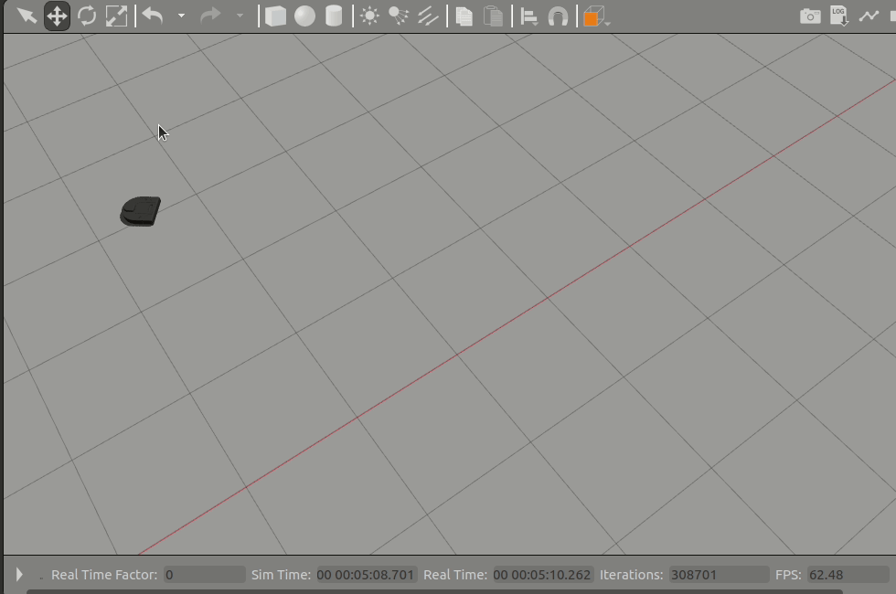

## Project Overview

Your goal in this project will be to program the Neato to execute a number of behaviors (teleop, driving a trajectory of a pre-defined shape, wall-following, people-following, and obstacle avoidance). In the process of implementing these behaviors, you will also learn about tools and strategies for debugging robot programs.  You are encouraged to be as creative as possible in this assignment. If you want to substitute another behavior for any of the following listed below, just let us know! For each of these behaviors, there is a straightforward way to implement the behavior and a more sophisticated way. See the "Going Beyond" section for some more information on these more sophisticated approaches.

You should be spending about fifteen hours on this assignment, so if you find yourself breezing through the required portions, we recommend that you push yourself a bit further! If you find that you are stuck or having a difficult time making progress, consider sending an [e-mail to the teaching team](mailto:vpreston@olin.edu) or coming to office hours. For everyone, feel free to post a discussion on the course Canvas site (even if you are not hitting roadblocks, sometimes it is a great idea to post what is working well for you so that you might trade ideas with your peers)! And please feel welcome to hang out around MAC113 (which you will need to do when working with the robots) as this will be the epicenter of all things CompRobo!

### Learning Goals

* Gain familiarity with ROS/ROS2
* Brush up on Python (or, if you are interested, [learn some C++](#working-in-c))
* Learn strategies for debugging robotics programs
* Learn about processing data from the laser range finder and bump sensors
* Learn to program robot behaviors using reactive control strategies
* Learn about finite-state robot control

### Project Showcase and Information Sharing

Show off something you did, or share a key piece of information you've learned along the way! Add it to <a href="https://docs.google.com/presentation/d/1IHTUBZ_jFnrjzV8K1kR34gl9X0XaGKAZjoRqxMrcg9U/edit?usp=sharing">this shared Google Slides presentation</a>.

We want to encourage resource sharing and collaborative learning as much as possible. Beyond posting on Canvas Discussions, consider adding knowledge for posterity though [this Google Doc](https://docs.google.com/document/d/15u9fvz5TsuPaSnvE1h_dyiVO2Rk7YTIyNweKpGGwuTE/edit?usp=sharing) which we've already populated with some tips and tricks!

### Logistics (and What You're Turning In)

You may work on this assignment with one other person from the class.  You will be turning in your project (both code + writeup) via Github. Make sure to let us know where your Github repository for this project lives using <a href="https://docs.google.com/spreadsheets/d/1ZIrGQ0a1rUCSRbk-eYSmbnXTedQA_49HQXRUSJu2z4Y/edit?usp=sharing">this Google sheet</a>.

We have included several extensions to the basic project that we hope will keep students that are coming in with more background knowledge (whether that be robotics knowledge or programming knowledge) engaged.  

You may find the [resources page](../useful_resources) useful for completing this assignment.

#### Using the Turtlebot4

If you are interested in trying out the Turtlebot4, send Victoria a note.  We will be compiling documentation on the [How to Use the Turtlebot4 page](../How to/use_the_turtlebot4).

## Your ROS2 Package: Code Structure

Your code should be placed in a ROS package called *warmup_project*. If you want to structure your code with more than one package, make sure to document the additional packages in your project writeup.  If you are unsure how to create a ROS package, [consult the ROS2 tutorial on creating a package](https://docs.ros.org/en/humble/Tutorials/Beginner-Client-Libraries/Creating-Your-First-ROS2-Package.html).  If you are working purely in Python (the vast majority of the class), follow the instructions for ``Python``.  If you are working entirely in C++ or a combination of C++ and Python, follow the instructions for ``CMake``.  To mix C++ and Python, you will have to jump through a few hoops.  See this [guide on combining C++ and Python in one ROS2 Package](https://roboticsbackend.com/ros2-package-for-both-python-and-cpp-nodes/).  Alternatively, you can turn in two ROS packages (one for C++ nodes and one for Python nodes).

Here are the files you will likely generate as part of this assignment.  If you deviate from this, that is fine, but hopefully it is a useful guide.

```bash
warmup_project/bags/drive_square_demo.bag
warmup_project/bags/finite_state_controller_demo.bag
warmup_project/bags/obstacle_avoider_demo.bag
warmup_project/bags/person_follower_demo.bag
warmup_project/bags/test_drive.bag
warmup_project/bags/wall_follower_demo.bag
warmup_project/resource
warmup_project/resource/warmup_project
warmup_project/setup.py
warmup_project/setup.cfg
warmup_project/test
warmup_project/test/test_copyright.py
warmup_project/test/test_flake8.py
warmup_project/test/test_pep257.py
warmup_project/package.xml
warmup_project/warmup_project
warmup_project/warmup_project/__init__.py
warmup_project/warmup_project/teleop.py
warmup_project/warmup_project/drive_square.py
warmup_project/warmup_project/finite_state_controller.py
warmup_project/warmup_project/obstacle_avoider.py
warmup_project/warmup_project/person_follower.py
warmup_project/warmup_project/wall_follower.py
warmup_project/README.md
```

In your github repository, create a markdown file called ``README.md`` to serve as documentation for your project.  Your writeup should answer the following questions.  We expect this writeup to be done in such a way that you are proud to include it as part of your professional portfolio. As such, please make sure to write the report so that it is understandable to an external audience.  Make sure to add pictures to your report, links to Youtube videos, embedded animated Gifs (these can be recorded with the tool ``peek``).

* For each behavior, describe the problem at a high-level. Include any relevant diagrams that help explain your approach.  Discuss your strategy at a high-level and include any tricky decisions that had to be made to realize a successful implementation.
* For the finite state controller, what was the overall behavior. What were the states? What did the robot do in each state? How did you combine and how did you detect when to transition between behaviors?  Consider including a state transition diagram in your writeup.
* How was your code structured? Make sure to include a sufficient detail about the object-oriented structure you used for your project.
* What if any challenges did you face along the way?
* What would you do to improve your project if you had more time?
* What are the key takeaways from this assignment for future robotic programming projects?  For each takeaway, provide a sentence or two of elaboration.

***Note: don't leave the writeup to the very end!  You will have a much better time if you document as you go.  The simple act of writing up your work will actually help generate new ideas and improve the organization for your robot programs.***

### Sample Writeups

Here are some writeups that are particularly solid.  We hope that these might get you excited about putting in the effort to document your work.
* <a href="https://github.com/ksoltan/comprobo_warmup_project/blob/master/warmup_project/CompRobo_Warmup_Project_Writeup.pdf">Matthew Beaudouin-Lafon and Katya Soltan</a>
* <a href="https://github.com/mary-keenan/comprobo_warmup_project/blob/master/warmup_project/writeup.pdf">Mary Keenan</a>
* <a href="https://github.com/therealcedz/comprobo_warmup_project/blob/master/warmup_project_ckim/Writeup/Warm_Up_Project_Report_CKim.pdf">Cedric Kim</a>
* <a href="https://github.com/yycho0108/comprobo_warmup_project/tree/master/warmup_project">Jamie Cho</a> does a great job documenting his work.  Some of the approaches he uses are very advanced (due to prior robotics experience that he had before taking the course).

### Intermediate checkpoint

Halfway through the project you should have the following parts of the project done.

* Simple visualizations using rviz
* Test drive bag file
* Teleop
* Drive square
* Wall following
* A preliminary writeup of your wall follower

## Using Robots and Simulators

You can use a combination of the simulated Neato and real Neato during your development cycle, however, **before the end of the project you should ensure that your code works on the physical Neato**. The documentation on how to use the physical and simulated robots, as well as the various topics (e.g., for accessing sensor data or sending motor commands), are documented on our <a href="../How to/use_the_neatos">how to use the neatos page</a>.

## Getting Started: Robot Debugging Tools
Before jumping in to programming robot behaviors, this activity is designed to help you get your development workflow set-up and assist you with the data-recording steps + write-up documentation evidence you'll want to be using later. 

### RViz

Probably the most important tool for debugging in this class will be [rviz2](https://turtlebot.github.io/turtlebot4-user-manual/software/rviz.html).  You can think of rviz (we'll usually leave off the ``2`` and just call it ``rviz``) as a specially tuned debugger for robots.  Consider the case of debugging a typical program by instrumenting your program with print statements.  These print statements may give you useful information as to the state (e.g. values of variables) of your program and, ultimately, help you find errors in your code.  This approach becomes infeasible when you work on robots with high bandwidth sensors (like the Neato).  The Neato sensory data consists of hundreds of thousands of numbers generated each second.  Visualizing all these numbers using print statements is infeasible.

Rviz contains visualization tools for common sensory data.  Further, there are some general purpose visualization messages that you can customize for your purposes. In this portion of the assignment, you will get familiar with using rviz with the Neato, and write a simple program to visualize arbitrary geometric shapes.

#### Part 1

For part 1 you will be using rviz to visualize the data from the simulated Neatos. Connect to the Neato. Read through the documentation for rviz and perform the following steps:

1. Set the ``fixed_frame`` to ``odom``
2. Add a visualization of the Neato's laser scan (topic ``/scan``).     This is most easily found by using the "By topic" tab.  Make sure to adjust the size of the markers so you can see them).
3. Add a visualization of the Neato's position by adding the ``Robot Model`` visualization, expanding the generated visualization in the tree in the ``Displays`` section and typing ``robot_description`` into the ``Description Topic`` field.
4. If you are using a Neato with a camera (or using the simulator), you can also add a visualization of the camera feed (topic camera/image_raw).

Save your rviz configuration so you can use it later (you can simply make it the default configuration by overwriting default.rviz or save it as a different file if you want to maintain the current default rviz behavior).

_You do not have to turn in anything for this part._

#### Part 2

Write a ROS node that, 10 times a second, publishes a message of type ``visualization_msgs/Marker``. The marker message you publish should specify to rviz to create a sphere at position x=1m and y=2m in the Neato's odometry coordinate system (odom). It is up to you how large and what color to make the sphere. Information on the ``visualization_msgs/msg/Marker`` message can be found on the [visualization_msgs Wiki](http://wiki.ros.org/visualization_msgs) (unfortunately the official documents haven't been updated for ROS2, so for our benefit we have [created an example in Python with ROS2](../Sample_code/marker_sample)). Place your screenshot in a subdirectory called **screenshots**.  Try changing the coordinate frame for your sphere to **base_link**.  How does the behavior of the visualization change?  Try changing the coordinate frame for your sphere to a different coordinate system (e.g.,  **base_laser_link**). How does the behavior of the visualization change?

_You do not have to turn in anything for this part._

### rosbag

Rosbag is a very useful tool for debugging robot programs.  The basic idea is to record all of the data from a particular run of the robot (laser scans, bump sensors, images, etc.), and then use this recording to help test and debug your code.  For instance, suppose you are writing code to estimate the positions of walls in an environment.  Given a recording of your robot moving around in an environment, you can iterate on your wall detection system until it works on this recorded test case without ever having to go back and interface with the physical (or simulated) robot! These recorded test cases are thus very useful for increasing the time efficiency and repeatability of your debugging process.

[Create a bag file](https://docs.ros.org/en/humble/Tutorials/Beginner-CLI-Tools/Recording-And-Playing-Back-Data/Recording-And-Playing-Back-Data.html) of you driving the Neato or the simulated Neato.  You can do this by using the ``ros2 bag record`` command.  Be careful not to record the ``/camera/image_raw`` topic or the topics under ``/gazebo/`` (as they will make your bag file get large very fast). In order to avoid recording these high data rate topics, you can use the following command (you can adjust this as needed for other robots).

```bash
$ ros2 bag record /accel /bump /odom /cmd_vel /scan /stable_scan /projected_stable_scan /tf /tf_static -o bag-file-name
```

> Note: these instructions result in an almost 50x reduction in file size when compared to capturing all topics

Where **bag-file-name** is where you'd like to store the recorded messages.

Once you have recorded your bag file, play it back and visualize the results in rviz. Make sure to disconnect from the robot before playing back your bag file!  Be very careful about the system clock when using rosbag. You want ROS to use the time stamps as they were recorded in the bag file, so be sure to specify the --clock argument when playing back your bagfile.

```bash
$ ros2 bag play path-to-bag-file
```

> Note: make sure your path to the bag file points to the bag directory (rather than either the metadata or the messages file located within said directory).

_Please push your, hopefully not too large, bag file to your repo in a subdirectory called **bags**.  Each bag file is represented as a directory containing the actual messages as well as some metadata.  If the bag file directory is more than 50 megabytes or so, something is likely wrong (e.g., you captured the uncompressed images on mistake).  For our convenience please name the bag something that allows us to determine which part of the assignment it corresponds to (you will be generating more bag files later)._

## Behavior Programming: Neatos Take On The World
This section describes the various behaviors we'd like you to program for your Neato. You are welcome to substitute any creative other behavior you can think of here, just let the teaching team know!

### Robot Teleoperation (Teleop)

While you are given a teleoperation program (``teleop_twist_keyboard``), here, you will be writing your own code to teleoperate the robot. If you get really ambitious you can try using a gamepad or the mouse.

Non-blocking keyboard input is surprisingly hard to do. To help, here is a skeleton program for getting the next key pressed when the focus is on the window where your program is running. The cryptic code '\x03' refers to control-c (which will exit the program).
```python
import tty
import select
import sys
import termios

def getKey():
    tty.setraw(sys.stdin.fileno())
    select.select([sys.stdin], [], [], 0)
    key = sys.stdin.read(1)
    termios.tcsetattr(sys.stdin, termios.TCSADRAIN, settings)
    return key

settings = termios.tcgetattr(sys.stdin)
key = None

while key != '\x03':
    key = getKey()
    print(key)
```

_Put your teleop code in the ``warmup_project`` subdirectory of your ``warmup_project`` package. For consistency, please put your code in a file named ``teleop.py``.  Make sure your node is referenced in your packages ``setup.py`` file._

### Driving in a Square

Write a ROS Node to move the Neato through a 1m by 1m square path.  You can solve this using either timing (e.g., turn at a fixed speed for a period of time) or using the Neato's on-board odometry.  We'll leave it to you which one to try (using timing is significantly easier).

_Put your drive square code in the ``warmup_project`` subdirectory of your ``warmup_project`` package. For consistency, please put your code in a file named ``drive_square.py``.  Make sure your node is referenced in your packages ``setup.py`` file._

#### Bag Recording

Using the rosbag instructions from earlier, record a demo of your square driving code in action.  Push your bag file to your repo in the ``bags`` subdirectory (again, use a suitable name so that we can tell which behavior it corresponds to).

### Wall Following

For this behavior your goal will be to pilot the Neato near a wall (e.g. using the teleoperation keyboard node... or just carry it!) and have the Neato move forward while aligning its direction of motion to be parallel to the nearest wall.

_When you are done, put your wall following code in the ``warmup_project`` subdirectory of your ``warmup_project`` package. For consistency, please put your code in a file named ``wall_follower.py``.  Make sure your node is referenced in your packages ``setup.py`` file._

To get started let's draw a simple picture of the situation.

<p align="center">

</p>

Building upon this simple picture, fill out what you can measure from your robot's sensors. What is the "goal" of your controller?

#### Hints

* Draw lots of pictures. Make sure you understand the geometry of the problem. 
* A fairly straightforward way to attack the problem is by using [proportional control](http://en.wikipedia.org/wiki/Proportional_control). If you want to do something more sophisticated you may want to look into PID control (see going beyond section).
* Sometimes various laser range measurements might not be present on every scan. In the diagram above we selected two specific laser measurements to make the problem easier, however, you should not limit yourself to just using these measurements. You will probably want to make your code robust by using multiple measurements (for redundancy).

#### Going beyond (some suggestions, but feel free to be creative)

* Properly incorporate the offset between the laser scanner and the center of rotation of the robot by using the tf module (the [TF tutorials](http://wiki.ros.org/tf2/Tutorials) are a great place to start).
* Incorporate the bump sensor in some way
* Allow the user to specify a target distance between the robot center and the wall. Your code should follow the wall at the specified distance. You may find a finite state controller to be a useful way to attack this problem (where one state is wall following and the other is adjust distance to wall).
* Handle 90 degree turns gracefully (either by continuing across the gap or following the turn and continuing to do wall following). You might consider writing a controller that defines splines, Bezier curves, or Dubins curves as trajectories for the robot to follow.
* Look into using [OpenCV's Hough Transform](https://docs.opencv.org/4.2.0/d9/db0/tutorial_hough_lines.html) or the RANSAC algorithm to do wall detection.
* Use [Ben Kuiper's writeup to make your wall controller critically damped](http://www.cs.utexas.edu/users/qr/robotics/internal/papers/tuning-controller.pdf).

#### Visualization

Whatever method you choose, you must visualize the detected wall using rviz.  To do this, publish a message of type visualization_messages/Marker (recall, that the documentation of this message type can be found [here](http://wiki.ros.org/rviz/DisplayTypes/Marker)). You can publish this message to any topic that you want, but make sure you add it to the visualizations in rviz so you can benefit from your hard work.

#### Bag Recording

Using the rosbag instructions from earlier, record a demo of your wall follower in action.  Make sure that when you record your bag file you are also recording the wall visualization from the previous step.  Push your bag file to your repo in the ``bags`` subdirectory (again, use a suitable name so that we can tell which behavior it corresponds to).

### Person Following

Pretend your Neato is your robot pet and get it to follow you around! The intended behavior is that you can walk in front of the Neato and it will follow your movements while maintaining a specified following distance.

_Put your person follower code in the ``warmup_project`` subdirectory of your ``warmup_project`` package. For consistency, please put your code in a file named ``person_follower.py``.  Make sure your node is referenced in your packages ``setup.py`` file._

***If you want to test this in Gazebo, you can use the basic shape models in Gazebo to test out your code.  For instance, here is a sample implementation being tested in Gazebo.***



#### Hints

* One way to think about this problem is that the Neato is attempting to keep the closest large object in front of it at a specified distance and immediately in front of the robot. 
* As in wall following, you may find proportional control to be a useful strategy. 
* There are many ways to figure out where the person is. A simple approach is to calculate the center of mass of the laser measurements that fall within a prescribed box relative to the robot. This diagram should help clear things up:
<p align="center">

</p>

#### Going Beyond

* The center of mass approach fails in a number of cases. One of those is when a large non-person object is within the person tracking region. Can you modify your code to handle this case? One strategy for handling this case is to follow moving objects within the person tracking region.
* Detect the characteristic pattern of two legs following the centroid defined by only these points.

#### Visualization

Whatever method you choose, you must visualize the detected person using rviz.  To do this, publish a message of type visualization_messages/Marker (recall, that the documentation of this message type can be found [here](http://wiki.ros.org/rviz/DisplayTypes/Marker)).  You can publish this message to any topic that you want, but make sure you add it to the visualizations in rviz so you can benefit from your hard work.

#### Bag Recording

Using the rosbag instructions from earlier, record a demo of your person follower in action.  Make sure that when you record your bag file you are also recording the visualization of the tracked location of the person from the previous step.  Push your bag file to your repo in the ``bags`` subdirectory (again, use a suitable name so that we can tell which behavior it corresponds to).

### Obstacle Avoidance

For this part you should program the Neato to move forward while reactively avoiding obstacles that block its path.

_Put your obstacle avoidance code in the ``warmup_project`` subdirectory of your ``warmup_project`` package. For consistency, please put your code in a file named ``obstacle_avoider.py``.  Make sure your node is referenced in your packages ``setup.py`` file._

A simple approach to the problem is to have the robot turn 90 degrees when it encounters an obstacle, and then turn back toward its preferred direction of motion once the obstacle is gone.

A more advanced approach to the problem is to use the concept of potential fields (see [this tutorial](http://phoenix.goucher.edu/~jillz/cs325_robotics/goodrich_potential_fields.pdf), or <a href="http://ijr.sagepub.com/content/5/1/90.short">the original paper</a>). Think of a force constantly pulling the robot forward while nearby obstacles (as detected by the laser range finder) exert repellant forces on the robot. The magnitude of the repellant force should increase as the robot gets closer to the obstacle.

<p align="center">

</p>

By summing the forces you can obtain a direction of motion for the robot (note: that the sum of forces is not shown in the diagram above). You can then use a proportional controller to steer towards this desired angle while still maintaining forward velocity.

#### Going beyond

* Instead of always trying to move forward, allow a goal to be specified in the robot's odometry coordinate frame (called odom). In order to best handle this, you will either want to listen to the ``/odom`` topic directly or else make use of coordinate transformations via the TF module (again, the [TF tutorials](http://wiki.ros.org/tf2/Tutorials) are a great place to start).

#### Visualization

While not required, we recommend that you choose a visualization strategy that helps you as much as possible.  Suggestions are to visualize the goal location using a circle, and to visualize the repulsive and attractive potentials using arrows (where the length of the arrow indicates the magnitude of the influence).

#### Bag Recording

Using the rosbag instructions from earlier, record a demo of your obstacle avoider in action.  Push your bag file to your repo in the ``bags`` subdirectory (again, use a suitable name so that we can tell which behavior it corresponds to).

### Combining Multiple Behaviors Using Finite-State Control

For this part of the assignment you have two choices:

1. Combine two or more of your behaviors from earlier to create a finite-state controller.
2. Implement a new behavior using finite state control

_Put your multiple behaviors code in the ``warmup_project`` subdirectory of your ``warmup_project`` package. For consistency, please put your code in a file named ``finite_state_controller.py``.  Make sure your node is referenced in your packages ``setup.py`` file._

You may find that drawing a state transition diagram is helpful. Each state should indicate either a different behavior or a different stage with a single behavior. Each transition should be some condition that you can reliably detect in the environment. For instance, we might combine wall following with person tracking in the following way:

<p align="center">

</p>

#### Visualization

While not required, we recommend that you choose a visualization strategy that helps you as much as possible.

#### Bag Recording

Using the rosbag instructions from earlier, record a demo of your finite-state controller in action.  Push your bag file to your repo in the ``bags`` subdirectory (again, use a suitable name so that we can tell which behavior it corresponds to).


## Other Ideas for Going Beyond

### Working in C++

If you are interested in learning C++ through this course, you can do so in this assignment.  If you choose to work in this fashion, please come talk to me beforehand so we can discuss how we might change the assignment requirements to accommodate your learning of this new material.  Please be aware that the C++ pathway is very much a work in progress, and you will be blazing the trail (with my help and with help from other classmates working in this way).  To get started, I have started [a page to serve as a place where we can put useful resources for learning C++ in general and using it for ROS2 in particular](../How to/learn_cpp).

### Use the ROS Actions Framework

The ROS actions framework is a great tool for managing behaviors like the ones you implemented in this project.  Consider reading [the actions documentation](https://docs.ros.org/en/humble/Tutorials/Beginner-CLI-Tools/Understanding-ROS2-Actions/Understanding-ROS2-Actions.html), and incorporating it into your code.

### Improve the Odometry

In the past, Paul had a framework for sending sensor data from an iPhone to ROS.  Paul would like to update this for ROS2 so that the Neatos could make use of the visual inertial odometry that comes from the ARKit library, point clouds from the iPhone 12/13 Pro's LIDAR, etc.  Implementing this would involve learning a bit about app development, some basic networking, and some more information about the ``tf2`` module.  Reach out to the teaching team if you are interested.

## Tips, Tricks, and Words of (Pseudo?) Wisdom

* Dealing with Quaternions.  Quaternions are a way to parameterize a 3-d orientation.  ROS uses them to supply things like the relationship between the axes of two coordinate frames (e.g., in the ``tf2`` module).  I have put together [an example of converting form quaternions to Euler angles](https://github.com/comprobo24/class_activities_and_resources/blob/main/sample_node_architectures/sample_node_architectures/get_odom_rpy.py).  For the Neato we are chiefly concerned with the yaw angle (as the Neato is confined to the ground).
* There is now a general [troubleshooting page](../How to/troubleshoot).
* We want to create an environment in this course where folks contribute interesting things they've learned to the rest of the class.  To accomplish this, we've created <a href="https://docs.google.com/document/d/15u9fvz5TsuPaSnvE1h_dyiVO2Rk7YTIyNweKpGGwuTE/edit?usp=sharing">a Google doc that we can use for collecting useful tips for this assignment</a>.  We've already prepopulated the document with useful information on calculating angle differences; converting a ROS pose to x, y, and yaw; and project a laser scan into the odometry frame.
* When programming robots you have to get used to the idea that your code is never "bug free" in the same way that an implementation of a sorting algorithm can be bug free (there is always more work to do to make your robot code more robust to various scenarios).
* When your robot is not doing what you expect it to, you are often faced with the decision of spending time tweaking your code to get it to work or spending time writing code to visualize / understand what your code is doing.  Students often are comfortable with the former (tweaking) and hesitant to pursue the latter (visualizing).  We advise you to push yourself to work on visualization and other means to understand what your code is doing.  You will find that for robotics programming, these visualizations will prove invaluable for rooting out bugs and finding ways to improve your code. 
