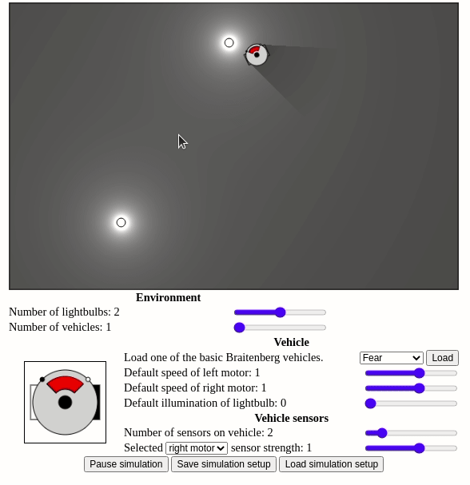
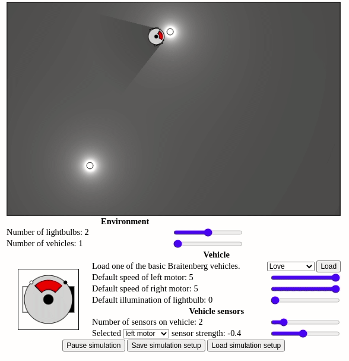

## Today

* Intro to the teaching team!
* Intro to CompRobo! (<a href="https://docs.google.com/presentation/d/19B0FtOo1qZqo8MxAklRULqWMokjUoezlMTHTjRkoUYE/edit#slide=id.p9">slides</a>)
* Robots in the World

## For Next Time

* Fill out <a href="https://docs.google.com/forms/d/e/1FAIpQLSei4PVd0RimqK2WrQOY3KJDUqfZ6dPUnpHqptM6EG2wJYdrBw/viewform">the course entrance survey</a>
* <a href="../How to/setup_your_environment">Get your environment setup</a>
* Go through the following ROS2 tutorials ([turtlesim and rqt](https://docs.ros.org/en/foxy/Tutorials/Beginner-CLI-Tools/Introducing-Turtlesim/Introducing-Turtlesim.html), [Understanding nodes](https://docs.ros.org/en/foxy/Tutorials/Beginner-CLI-Tools/Understanding-ROS2-Nodes/Understanding-ROS2-Nodes.html), [Understanding topics](https://docs.ros.org/en/foxy/Tutorials/Beginner-CLI-Tools/Understanding-ROS2-Topics/Understanding-ROS2-Topics.html), [Understanding services](https://docs.ros.org/en/foxy/Tutorials/Beginner-CLI-Tools/Understanding-ROS2-Services/Understanding-ROS2-Services.html)

* [Connect a Neato and run the Neato simulator](../How to/use_the_neatos).  Explore the topics that are published and see what you are able to do with them given the tools you learned about in the ROS2 tutorials.
* (probably won't have time for this before next class) Start working on <a href="../assignments/warmup_project">the Warmup Project</a>

## Robots in the World

## Sensory-Motor Loops (legacy material if you are interested)

In our view, at their very core robots are about sensory-motor loops.  We can visualize this relationship in the following way.

This feedback loop can cause very simple sensory-motor mappings to exhibit complex behavior.  In fact, you will be amazed at the capabilities of some of the very first robots.  Meet the Neato's predecessor! (apologies for the antiquated language)

<iframe width="560" height="315"
src="https://www.youtube.com/embed/lLULRlmXkKo"
frameborder="0" 
allow="accelerometer; autoplay; encrypted-media; gyroscope; picture-in-picture" 
allowfullscreen></iframe>

The pioneering work of Grey Walter was followed up by a number of others.  One particularly interesting work was by Valentino Braitenberg.  Valentino Braitenberg was interested in how very simple sensory-motor loops could elicit behaviors that when viewed by humans would evoke emotion and feelings of intelligence and intentionality (on the part of the robot).  The name typically used to refer to these hypothetical robots is "Braitenberg Vehicles".  While Braitenberg never actually built these robots (he was more interested in how these simple robots might inform various philosophical issues, particularly in the philosophy of mind), others have followed up and actually built these robots.

Here is a video from a group at MIT that built several of Braitenberg's vehicles.

<iframe width="560" height="315"
src="https://www.youtube.com/embed/VWeRC6j0fW4"
frameborder="0" 
allow="accelerometer; autoplay; encrypted-media; gyroscope; picture-in-picture" 
allowfullscreen></iframe>

### Base Robot

The robots in the video are quite simple.

**Motor system:** the robot moves using something called differential drive.  All this means is that when both wheels move in the same direction (either forwards or backwards), the robot moves in a straight line in the same direction (assuming the wheels move at roughly constant speed).  If the wheels move in opposite directions the robot will spin in place (which direction the robot spins depends on which wheel is moving forward and which is moving backward).

**Sensory system:** the robot has three different types of sensors:
* A whisker sensor that can tell when something is touching it (you can see that in the video under "insecure")
* A bump sensor that turns on when it runs into something
* A light sensor that emits higher values when in the presence of bright light and lower values when in darkness (you can think of this as very primitive single pixel camera!)

In your breakout rooms you will design your first sensory-motor mappings, and by doing so, we will define our first robot programs.  Instead of using a programming language, you will write your programs graphically on (Zoom) whiteboards.

For instance, suppose we wanted to implement the behavior of the wary robot whose behavior mainly consists of moving forward until it encounters a shadow (and then stopping).  First, let's draw our robot and label it's motors and sensors:

We will use the symbol $$m_1$$ to refer to the left wheel (positive means the wheel is moving forward, negative is backwards, and 0 is stopped).  $$m_2$$ is similar to $$m_1$$ but for the right wheel.  the symbol $$l$$ refers to the value of a light sensor (the higher the value the more light detected).

In the case of robots whose behavior is purely based on their current sensor values, we can fully specify the robot's behavior by defining the sensory-motor mapping.  We know we want the robot to move at full speed in situations with a lot of light and stop in shadows.  In order to express this mapping, we can use a simple plot to show the relationship between the two motor outputs and the light sensor input.

This seems reasonable, but how can we build confidence that this is the correct mapping before we implement.  One way is to put the robot in a specific situation and to simulate the behavior that would be generated by the sensory-motor mapping above.  Next, I will show three key frames form a situation that help to build confidence that the mapping above is reasonable.

First, the robot is in full light (a.l.l. stands for ambient light level) and thus the two motors are at roughly full speed.

Next, the robot has moved partially into the shadow (depicted with black lines) which causes the light sensor value to drop and the speed to drop to about half speed.

Finally, the robot is sufficiently into the shadow that it stops entirely.
In your breakout rooms, work through generating robot programs to realize the behaviors in the video. 

***Questions to keep in mind while doing this activity***
1. Depending on some of the assumptions you make about how the motor system works, one of the behaviors cannot be reproduced without some form of memory.  Which behaviors are these?  How can you tell? 
2. In what interesting ways could the light sensor and the whisker sensor be combined in a single video?  What would the resultant behavior of this vehicle be?  What would you call your new vehicle?

### Braitenberg Vehicle Simulations

In this next part of the assignment, we'll be using a [simulator for Braitenberg vehicles](http://www.harmendeweerd.nl/braitenberg-vehicles/) to build a more quantitative understanding of sensory-motor loops.  In order to use the simulator, you can navigate to the linked page and perform the steps shown in the video below.  This example shows how to load the "love" Braitenberg vehicle.

As you can see in this video, this robot uses its light sensors in order to approach and then stop at light sources.  To explore what the "love" vehicle is doing we can click on the various light sensors of the robot to see how they are wired to the robot's motors.

Notice how the only difference when we click on one sensor or the other is which motor it is wired to.  The right sensor is wired to the right motor and the left sensor is wired to the left motor.  From the visualization you can see that the baseline speed of the motor is 5, but that for each unit of light that the sensor sees, the speed goes down be 0.4 (since sensor strength is $$-0.4$$).

1. Similar to what you did before, draw the relationship between the left and right motor speeds and the light sensor value (you will have to make some assumptions here).
2. Suppose you wanted the love vehicle to stop farther away from the light source, how would you modify the vehicle to achieve this?  Are there multiple approaches?  Try one of your solutions out in the simulator.
3. Once you've implemented your solution on the simulator, try placing your robot in various locations.  Are you surprised by any of the behaviors?  Try to make sense of what you see by referring back what you know about the sensory-motor mapping.

### Additional Exercises

At this point, you can feel free to come up with your desired behavior and see if you can create a Braitenberg vehicle to realize this behavior.  Instead, you can also work on creating vehicle for each of the following behaviors.  ***We are intentionally giving more than you can probably do in during class, so don't feel like you should be able to finish all of these.***

1. Build a vehicle that will turn towards a light source if it passes it on its left side and turn away from it if it passes a light source on its right side.
2. Build a vehicle that, like the love vehicle, approaches light sources.  The key difference is that this vehicle should stop with its front at a 45 degree angle from the light source.
3. Build a vehicle that orbits around light sources. 
4. Build a vehicle that drives back and forth over a light source.
5. Can you think of a behavior that *could not* be realized in the simulator (i.e., there is no possible way to configure the vehicle to achieve the behavior)?
6. Come up with an interesting behavior and see if you can replicate it in the simulator. 

### Additional resources

* [Braitenberg creatures](https://cosmo.nyu.edu/hogg/lego/braitenberg_vehicles.pdf) (this paper describes the LEGO robot in the video embedded above).
* [Social Integration of Robots into Groups of Cockroaches to Control Self-organized Choices](https://science.sciencemag.org/content/318/5853/1155) cool paper showing robots influencing actual cockroach collective behavior!
* For even more crazy ideas for sensory-motor loops, checkout [the Wikipedia page on BEAM robotics](https://en.wikipedia.org/wiki/BEAM_robotics).
