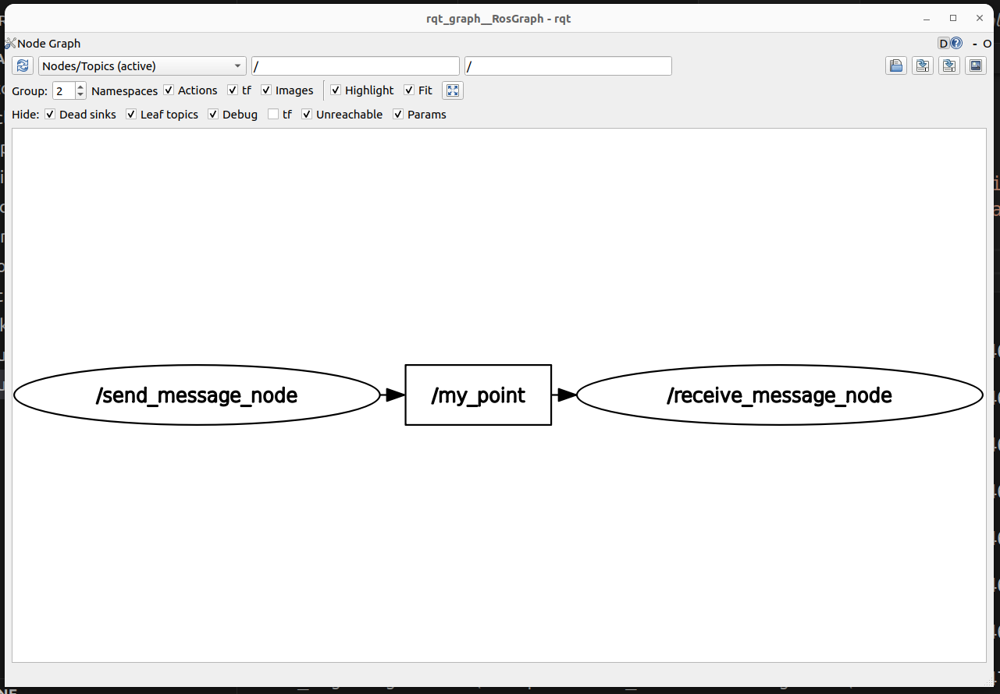
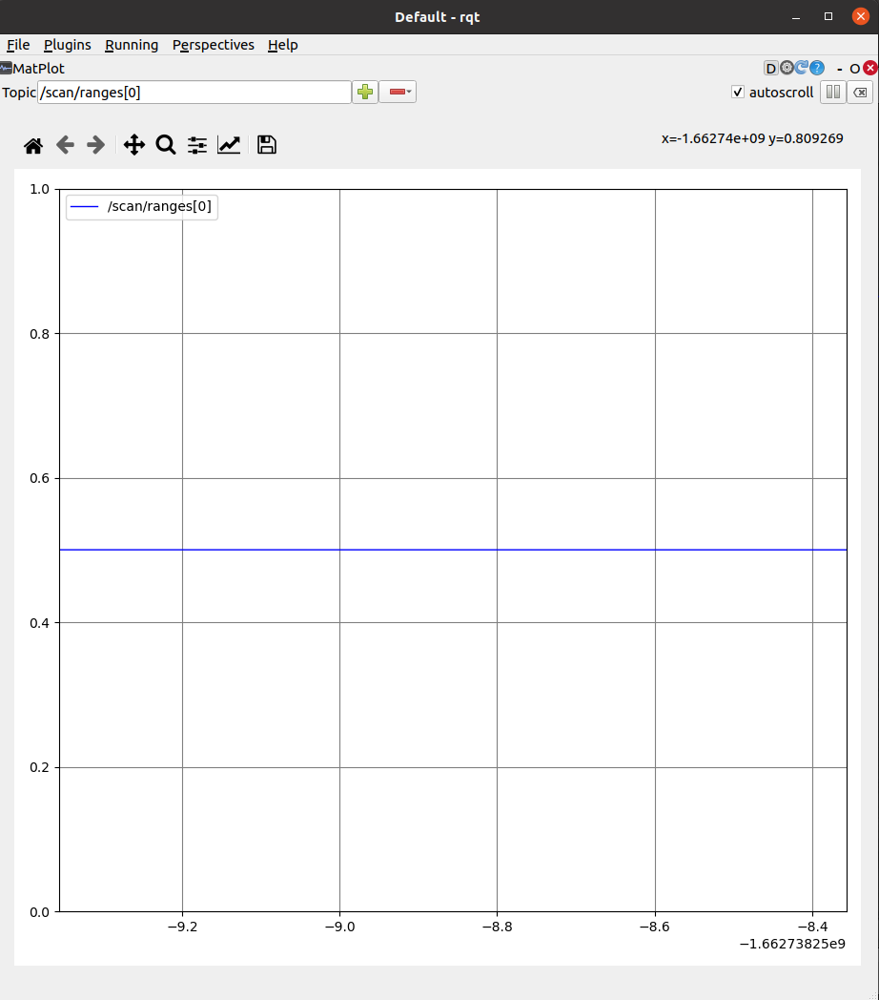

## Today
* What are Broader Impacts? (Discussion Activity)
* Follow-Up on Nodes (For Your Reference)
* Writing our first sensory-motor loops (Group Exercise)

## For Next Time
* Work on the <a href="../assignments/warmup_project">the Warmup Project</a>.  There is an intermediate checkpoint due on Tuesday 17th at 1PM ([assignment page on Canvas here](https://canvas.olin.edu/courses/822/assignments/13048)).
  * If you haven't already, please list your team and a link to your Github on the [Teaming Sheet](https://docs.google.com/spreadsheets/d/1ZIrGQ0a1rUCSRbk-eYSmbnXTedQA_49HQXRUSJu2z4Y/edit?gid=0#gid=0).
  * The final warm-up project deliverables will be due Monday 23rd at 7PM! Next week we will have open studio time during class (you can plan for at least ~40 minutes in each class).
  * A rubric for the project is available [on Canvas](https://canvas.olin.edu/courses/822/assignments/13049).
* Work on the [Broader Impacts assignment Part 1](../assignments/broader_impacts), due on Tuesday 24th at 1PM.

## What are Broader Impacts?
As we touched on during the first class meeting, and as you've started chewing on in the Broader Impacts assignment, robots -- by virtue of being embodied in the world -- uniquely engage with the world in a way that other forms of computing-based technology may not. "Robo-ethics" is a subfield within robotics that formally designs and ascribes methods of analyzing the impact of robotic systems. Some resources you might find interesting as a launch point to learning more about the robo-ethics field are below:
* Standford Encyclopedia of Philosophy entry on [Ethics of Artificial Intelligence and Robotics](https://plato.stanford.edu/entries/ethics-ai/)
* [Building and Evaluating Ethical Robotics Systems workshop](https://www.ers-workshop.com/) at IROS (one of the two largest and most well-known robotics conferences in the world)
* [An Economics Perspective on "Robotics at Work"](https://watermark.silverchair.com/rest_a_00754.pdf?token=AQECAHi208BE49Ooan9kkhW_Ercy7Dm3ZL_9Cf3qfKAc485ysgAAA7YwggOyBgkqhkiG9w0BBwagggOjMIIDnwIBADCCA5gGCSqGSIb3DQEHATAeBglghkgBZQMEAS4wEQQMZLkTwB9HgtoaRAFMAgEQgIIDadCNISVVMpDrlENyL-Jky9bDY4JksfzRpkUohr3IiokebXqXNcQ5to_uhPN9mlXocCy7kXBIrmww_m7bxSg58f1uSiP0mNsXD4gr0A1gHsS-lfScqhxgzsmRa80sCiGGM_mUBJ_U7dZ9JusK8Vg78oVNd5CdsplbQBrX4aiQPps61Mb5ZP7SRBDatg0clLlj7t6MgdcZ1KX1Pv9Ln_ZBuRNPIaNpMNAJMzSqADaFYfkrSVWbdcqRTy20E56gJ-rtEEIK10Q6PUQbnY7x052YFrIFYCbiMBBaubvfrWmkLeHStxCSUKpr3FaThIQQ0LnvRQtM1ewsFdRqEidrtldPnYAQofVqfVfPXY93pTTdGGDj2nhmjYPqTOjGevXktJg9H9jO8ilHe4k07zjGtLxCWH4Px_5jfSFw0QhdvhPDTw1Y_ofl_xacRisFejQIuaCvxnFny0RMMtXexdUB_NbTp2eP070sYXOYfqhzHCFjfyBN9xDhefECQxptToCI5wXxZV2LpblRousIFu5cUpomLMO1EITaVroluTau0tMLqY_8q-0B2Ab2TugxhMmC6HNKShzeIF7kQf3LEBkOiiOA1LLWsAZH5YZiC9mHqWYSd6NHrttRCcj9c-mL6kxI4gz0S6dPQqqDXnG1z9bJor0JNnKlIO_CpSE1WE8MiXLDZNNxdF-1rYa91fs4boLHN9SRr88tOQYj08oi8cMk2pycMxyeCrfPMyj_rTeoL27wICb-39MEp6eT8Uxp7AbPFd_B_0dlulpORaK1fpDxEdUnv2wngwbeY8cgzRQE-yEd_hWGyDhlh67gkIQ5X6MIVA1b0GlMWAMgoKGpJpn5q9jDmTwuV4X4ln3RgsD384ozZBf3hkXu-RVQKUcPFiSCrQLE6j97KE5yahSVJnPd_bAor5t4XgASyeQ3chDKatR5oBPyUrft3X9ksQK1GJz0Hr9Q3hZbnjzKXQCwlgxCZz0CRmWAx4HbdXG-IkKqQLObUNi55_0F-La1zsIMoxp69dCeimP33UkwSdfLi0R7KnX6XSHUAtwEEXRfJMg6_P_aoFxYRb_CDyLyLrrOSKYLRPolzE3PRgAz2f5xKu3eHo1YBbGhIKRHirJkMoVe8qHJPpCYKFl6D4HKQWvDg3wZJAEubGQ6eG24URt-TA) which analyzes the impact of robots on labor and implications
* [An Academic Discussion of Fairness and Abstraction in Sociotechnical Systems](https://dl.acm.org/doi/pdf/10.1145/3287560.3287598) which highlights the "traps" that fair practices can encounter when actually deploying systems at-scale

While robo-ethicists make it their primary vocation to understand the nuances of robotics use, every roboticist or robotics-adjacent engineer, manager, researcher, or entrepreneur deals with practical quandaries each day that require applying (implicitly or explicitly) a values-based framework -- from the design of a particular interface (for whom will this interface be for? how much information from the backend should be legible?), selection of components (what is the lifecycle of this part? who is supplying this part?), and creation of design specifications (what is the intended use of the robot? how will that intended use be protected?).

### Open-Ended Discussion - Broader Impacts and Robotics Funding

"Broader Impacts" is a term that attempts to make apparent the values or ethics based systems that people apply to the technology they produce or work that they engage in. [The National Science Foundation (NSF) in the US requires a "broader impacts" component to research proposals](https://new.nsf.gov/funding/learn/broader-impacts), where the definition of a broader impact is expansive, and may cover:
* Public engagement in the work to be completed
* Developing partnerships across academic / industrial sectors, or across disciplines
* Explicitly working on a project that contributes to societal well-being
* Contributing to national security
* Ensuring participants are representative of various backgrounds and their engagement is inclusive

Let's have a look at a broader impacts statement from a NSF proposal submitted to the NSF National Robotics Initiative solicitation, entitled ["Never-ending Multimodal Collaborative Learning"](http://www.cs.cmu.edu/~cga/proposals/nsf-nri-19.pdf), which proposes to develop algorithms for robot-learning and task-generalization through natural language and visual/kinesthetic demonstrations performed by a human teacher:

> The National Robotics Initiative was a three part solicitation over a decade that aimed to support fundamental research in the US. This flavor of the NRI was aimed at "Ubiquitous Collaborative Robots" and research to advance the development and use of co-robots (robots that work with/near people). Ubiquity was defined as "seamless integration of co-robots to assist humans in every aspect of life." You can read the full solicitation [here](https://nsf-gov-resources.nsf.gov/solicitations/pubs/2019/nsf19536/nsf19536.pdf?VersionId=CHKRGmHnTh_vEx4KZmJkbN.mz30N7kPV). This program was sunset in 2022.

```
The proposed research will reduce the cost of programming robots and other technology, such as personal
assistants. Non-experts will be able to program and personalize robots similarly to how we program
fellow humans and especially children: by communicating in natural language (e.g., "stop fidgeting") and
demonstrating visually the desired way to do things (e.g., "open it like this"), as opposed to being
programmed by writing code or through millions of positive and negative examples. Robots will be able
to acquire new concepts and skills adapting to individual users' needs through interaction with end-users,
as opposed to maintaining a fixed set of functionalities predetermined at the factory.
The simplicity and directness of grounded natural language interfaces will help robots better serve older
adults and people with disabilities. This is just one example of the proposed technology's potential for
social good. This research is tightly coupled to the educational program of the PIs, which currently
includes a course on language grounding on vision and control, and another on architectures for never-
ending learning, with the goal of teaching students that there is more to AI than learning from a large
number of positive and negative examples.
```

Get together with some folks around you, and consider the following questions (~10 minutes):
1. Using the definitions from the NSF broader impacts page, what key themes do you see emerge in this paragraph? 
2. What evaluation metrics would you use to assess whether the broader impacts goals were met over the course of this project? 
3. Are there other broader impacts that the authors don't mention, but might be relevant to their project? Are there any unintended impacts of the work that could be considered by the project?

We'll do a brief report out (~5 minutes) with the whole class.


## Follow-up From Last Time (For Your Reference)

### Uniqueness of Node Names

ROS2 Nodes should have unique names.  There is support for changing the node name when launching a node (or specifying a unique name in the launch file).  If you start two nodes with the same name, the system will allow you to do it, but you will get a warning that things might go bad (ominous!).  For example, I can set the name of the teleop node as follows.

```bash
$ ros2 run teleop_twist_keyboard teleop_twist_keyboard __name:=my_name
```

You can verify this worked, by running the following command.
```bash
$ ros2 node list
```

### Listening to ROS2 Traffic

We discussed multiple ways to diagnose whether your publishers are operating as expected; any of the following commands can get you to interfaces that verify that your topic is publishing and that the information appears correct:

```bash
$ ros2 topic list
$ ros2 topic echo /topic-name
$ rviz2
$ rqt
```

How do we know if our subscribers are working? Well, we can see if the node is initialized by running:

```bash
$ ros2 node list
```

But if we want to know whether the node is receiving data properly, we'll need to add code in our subscribers that will either print messages to terminal (for manual inspection), throw time-out errors if we don't get any messages (and expect to get some within certain windows of time), or record rosbags for later debugging. You can also consider adding tools like `ros2doctor` (https://index.ros.org/p/ros2doctor/) that can perform some diagnostic functions on your ROS2 network. And you can check if all the message "plumbing" looks right by using the utility `rqt_graph`:

```bash
$ ros2 run rqt_graph rqt_graph
```

which will show you a map of your nodes and messages:

<p align="center">

</p>

## Sensory Motor Loops

One way to think of the intelligence that drives a robot is as a sensory-motor loop.

<p align="center">

</p>

Today, we will be building on the basic ROS nodes we wrote last time to create a ROS node that both integrates sensory data (through subscribing to a topic) and outputs a motor command (by publishing to a topic). Perhaps one of the first things you should always consider when working with a robot, is how to keep it, and you, safe. Let's build some software-side emergency stop features,

### Creating our First Sensory Motor Loop

> Sample solutions to this can be found in the [``class_activities_and_resources`` Github](https://github.com/comprobo24/class_activities_and_resources) repository under ``in_class_day03_solutions``. (if you are looking for the C++ solutions, look in the directory ``in_class_day03_cpp_solutions``).

Find another person in the class to work with.  If you're paired up for the warmup project, consider working with that person.  In pairs, you will begin to explore the idea of a sensory-motor loop on the Neatos.

#### Create a Package

In order to get started, create a package for the code that you will be writing today.  As with all ROS packages in your workspace, it must be inside of your ``ros2_ws/src `` folder.  Besides this requirement, you are free to put the package anywhere.

```bash
$ cd ~/ros2_ws/src/class_activities_and_resources
$ ros2 pkg create in_class_day03 --build-type ament_python --node-name emergency_stop --dependencies rclpy std_msgs geometry_msgs sensor_msgs neato2_interfaces
```

#### Bump Emergency Stop

The first sensory-motor loop we will create is one in which the robot moves forward at a fixed speed until it senses an obstacle (using the bump sensor) and then stops.  For a rundown of the bump sensors on the Neato, check out the <a-no-proxy href="../How to/use_the_neatos">Using the Neatos Page</a-no-proxy> page.

Hints:
* You need a way to access the bump sensor data, and once you have that data, tell the Neato what to do with certain inputs. Consider listing out what you need to _subscribe_ to, and what you need to _publish_ to start.
* Assuming you are using classes to define your ROS nodes, you can create a class attribute (`self.attribute_name`) to share data between class methods.

If you execute the ``ros2 pkg create`` command given above, there should already be a file called ``emergency_stop.py`` created for you.  If you placed your package in ``ros2_ws/src`` it will be located at: ``~/ros2_ws/src/class_activities_and_resources/in_class_day03/in_class_day03/emergency_stop.py``. You can use our work from Day 2 to get started writing your nodes as well.


#### Proximity Emergency Stop: Using the Laser Range Finder

The next sensory-motor loop that you create should be called ``distance_emergency_stop.py``.  In order to add this node, you will have to modify the ``setup.py`` file in your ``in_class_day03`` package (like we did on day 2 with our recieve_message node).

The ``distance_emergency_stop.py`` node should be _identical_ to ``emergency_stop.py`` except it should use the laser range finder to detect when an obstacle is within a specified distance and stop if this is the case. It is up to you how you implement this.  You can either use just the measurements in front of the robot, or perhaps use all of the measurements.  You may want to use an all-or-nothing control strategy (also called bang-bang) where you are either going ahead at some fixed speed or you stop completely.  Alternatively, you may use something akin to proportional control where your speed slows proportionally with how close you are to the target distance.  Again, for more detail on using the Neato sensors (including the laser range finder), see the <a-no-proxy href="../How to/use_the_neatos">Using the Neatos Page</a-no-proxy> page.

Once you implement this, you may consider using the command line tool ``rqt`` to add a visualization of the laser scan data.  This plot shows ``scan/ranges[0]`` (the measurement straight ahead).  For a ``0.5m`` target distance, here is what ``rqt`` may show:
<p align="center">

</p>
