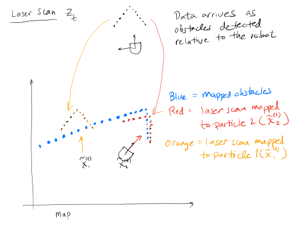
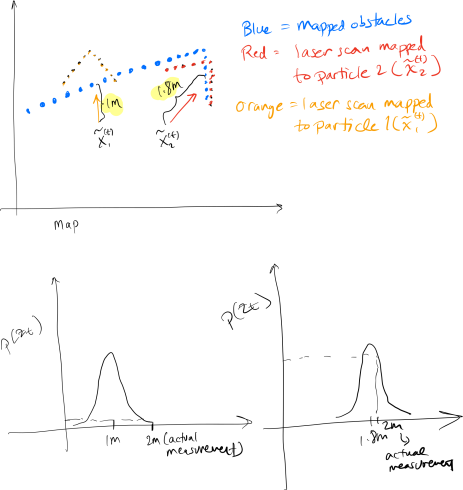

## Laser Scan Likelihood Functions

* Laser scan likelihood functions
* Fair Access to Robotics Discussion
* Project work time

## For Next Time

* Keep working on the particle filter project

## Laser scan likelihood functions

Remember that one step of our particle filter is to reweight each particle based on how well the laser scan "fits" with a map.  More precisely, we had the following equation to compute the weight of the $$i$$th particle.

$$w_i = \frac{p\left(z_t | x_t=\tilde{x}^{(t)}_i\right)}{\sum_{j=1}^m p\left(z_t | x_t=\tilde{x}^{(t)}_j\right)}$$

Where in the preceding equation $$\tilde{x}^{(t)}_i$$ was the $$i$$th particle at the $$t$$th step after applying the motor model update.

In order to make sense of the preceding equation, we will need some idea of how to calculate the conditional probability (the probability of the sensor data given a potential pose of the robot).

### General approach

For a particular laser scan, each particle prescribes a different mapping from the robot-centric coordinate of the laser scan to the coordinate system of the map.

From the figure above we can intuit that the laser scan data we received would probably be more likely if we were at particle 2's position than at particle 1's position, but how do we assign a number to this intuition?

The typical approach to the problem is to think about the various causes that could explain a particular laser scan measurement.  Returning to the figure above, let's say that the scan distance returned for the reading directly in front of the robot is $$2$$ meters.  Here are some possible causes that could explain this observation.
1. The laser scanner intersected an obstacle from our map (this is the ideal scenario as it would provide great information to help us localize the robot).  Probably there is some measurement noise as well.
2. The laser scanner intersected an object that we didn't have have in our map (this is likely to confuse our attempts to localize).
3. The laser scanner didn't return any data at a particular angle
4. The laser scanner returned some sort of random measurement (it's hallucinating).

When we determining the probability of our laser scan measurement we might consider what the probability of the data would be under each of these cases.  The overall likelihood could then be constructed as a weighted average of each of the probabilities.

In order to dig into (2)-(4), we will refer you to [these detailed notes](http://ais.informatik.uni-freiburg.de/teaching/ss10/robotics/slides/07-sensor-models.pdf) (start looking on slide 8).  Note that much of the material in these slides is from Thrun and Fox's "Probabilistic Robotics" ([a draft copy](https://docs.ufpr.br/~danielsantos/ProbabilisticRobotics.pdf) is available freely online).  In order to figure out the probability of a laser scan measurement if it did indeed contact an object in our map, consider the following picture (remember we are considering the case where the laser scanner returns a reading of $$2$$ meters directly in front of it).  We have updated the figure to show the predicted distance that the laser scanner would measure directly in front of the robot *if the robot actually were at the location specified by each particle*.  Additionally, we show a probability density function that assigns a number to each possible reading from the laser scanner (note that the probability density is shifted for each particle since the predicted scan distance depends on the particle's position in the map).

As you can see from the graph, the probability that we read off from the second particle is higher than the one we read off from the first.  This should make sense since the scan projected from the second particle is a closer match to the map than the scan projected from the first particle.

This approach is often called a beam model since we move along a particular scan direction from the particle until it intersects with an object (following the beam of the laser scan).

### Scan-based models (likelihood field)

The main difference between a scan-based model and a beam model is that for scan-based models you directly compare the scan to the map and determine how close of a match it is.  We skip over the step of determining where we *should* have seen an obstacle given a particle location and a laser scan reading.  In a likelihood field model, the probability of a scan given a position and orientation in the map is based on how closely the end point of the scan matches a known obstacle in the map.  Returning to our example from before, we would measure the distance of the point $$2$$ meters in front of each particle to the closest obstacle in the map and then compute the probability of that distance.  A very close match (distance close to 0) would give a higher probability than a match that is not that close (distance much greater than 0).  Consult the notes linked earlier in this document for some more detail on specific ways to do that (or ask us directly!).

Note: that we have given you an implementation of a class called ``OccupancyField`` that allows you to query a particular location in the map and determine the distance to the closest obstacle.  We have optimized this function (to some extent) since you will have to call it repeatedly.

### Combining multiple measurements

Up until now we've only thought about how to calculate the probability of a single measurement given a particle location.  For our Neato we are going to get 360 measurements for each scan.  As a result we need a way to compute the overall probability of a scan instead of just a single measurement.  Let's use the notation $$z_{t,j}$$ to refer to the $$j$$th scan reading at time $$t$$ (e.g., in our Neato we could consider that $$j$$ goes from 1 to 360).  We'd like to compute the following probability.

$$p(z_t | x_t) = p(z_{t,1}, z_{t,2}, \ldots, z_{t,n} | x_t)$$

Where $$n$$ is the number of measurements in a particular laser scan.  A very common assumption that is applied to simplify this is that each of the measurements is conditionally independent given the robot's state $$x_t$$.  Applying this assumption yields the following equation.

$$p(z_t | x_t) = p(z_{t,1} | z_{t,1}) \times p(z_{t,2} | x_{t}) \ldots \times p(z_{t,n}|x_t)$$

You might imagine other things that would make sense (e.g., averaging the probabilities).  It probably helps to think about what sorts of behavior these two alternatives would have.

In [reality](https://github.com/ros-planning/navigation/blob/a9bc9c4c35a55390963db1357926ec461fcff24c/amcl/src/amcl/sensors/amcl_laser.cpp#L293)... there are some very ad hoc ways of combining measurements (we'll talk about why this makes some sense, but if someone can find a more principled justification, it would be great to hear it).  Also see this [pull request](https://github.com/ros-planning/navigation/pull/462) for some interesting discussion.

## Fair Access to Robotics

* Slides: <a-no-proxy href="https://docs.google.com/presentation/d/1dE-yPRNsVzmszORohqEZeSojh2N8vvCuAHm5JYNYIyY/edit#slide=id.p"> here </a-no-proxy>
* As a reminder, these were our discussion readings: 
  * <a-no-proxy href="https://obamawhitehouse.archives.gov/blog/2015/05/08/ensuring-students-have-equal-access-stem-courses"> Equal access to STEM</a-no-proxy>
  * <a-no-proxy href="https://medium.com/@furhatrobotics/a-robot-in-every-classroom-furhats-vision-for-education-5b0ca8d56e0e"> Robots in classrooms </a-no-proxy>
  * <a-no-proxy href="https://new.abb.com/news/detail/4431/abb-and-the-economist-launch-automation-readiness-index-global-ranking-for-robotics-and-artificial-intelligence"> Automation globally </a-no-proxy>