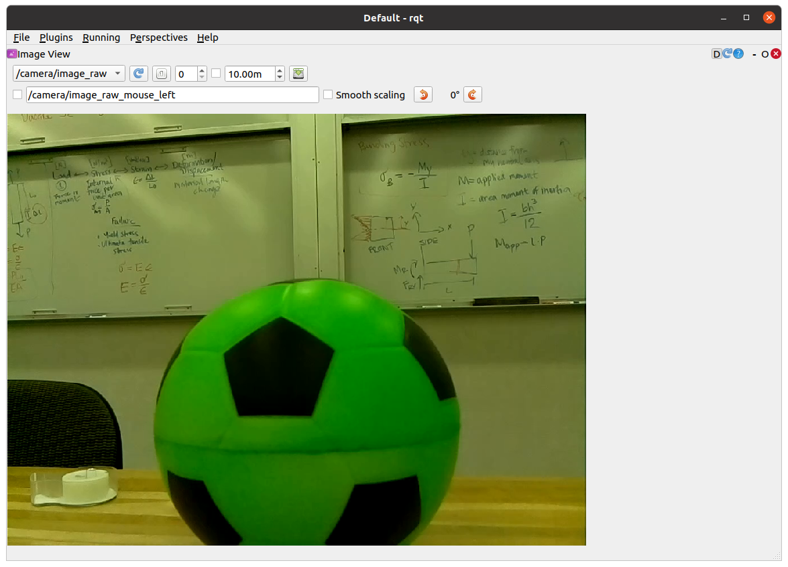

## Today
* Waste Sorting with Robots
* Neato Soccer + Project Proposal Check-Ins + Studio

## For Next Time
* Work on the [Broader Impacts assignment Part 2](../assignments/broader_impacts), due on **November 5th at 7PM** 
  * Note -- discussions will happen on October 28th, October 31st, and November 4th; you have been [randomly assigned one of these days to lead a discussion](https://docs.google.com/spreadsheets/d/1t2wJVq1ryEH47zOyPqVHE0VHtDHGa2fm6ehskNi13aA/edit?usp=sharing). You may swap slots with someone on a different day, but you have to let an instructor know. Thanks!
* Work on your [Machine Vision Project](../assignments/computer_vision_project).
    * In-class demos will be on **Monday November 11th**, and code/write-ups are due on **Tuesday November 12th at 7PM**.
    * Note that prospective students will be joining us in class on the 11th!
* Consider whether there is [feedback you'd like to share about the class](https://forms.gle/giCwA1pkr4y3e4T37)


## Waste Sorting with Robots
Today we're going to have a look at a [several very different types of robot waste sorters by looking at some literature](https://docs.google.com/document/d/1IKP9IC89pzonNTLGESe2nlPENpLKPwmMqC8PwAT20PM/edit?usp=sharing). To attend to:

1) What are the goals of these waste-sorters? Are they similar/different? Are their contexts similar/different?

2) What are the forms of these waste-sorters? What systems are the composed of?

3) How is machine vision used on these waste-sorters? What algorithms are being used and what tasks are being performed?

4) If there is information about it, how well do these systems perform their tasks? What are areas of strength? Weakness?

> To get the gist of a paper quickly, focus on the Abstract, the Methods, and the Results sections; then look at each of the figures + captions. Consider writing down the name of each robot somewhere, and jotting down the goal, the context, the key algorithms, and your impressions underneath the names. 

When you've had a look at these robots (choose at least 2!), in your groups, reflect on:
* Do the proposed methods align with the goals of these waste-sorters? Do they appear well-matched for the context that these waste-sorters will be used in?
* Is machine vision necessary for these waste-sorters to perform their functions? Why or why not?
* Who do you think would benefit from using these waste-sorters? What concerns do you have about these waste-sorters?


## Neato Soccer
This activity is designed to get you up-and-running with OpenCV and ROS with our Neatos to implement a simple sensory-motor loop using image inputs. Let's play some soccer! 


### Connect to a Neato
Grab a Neato with a partner or two -- make sure you pick one of the Neatos with a camera attachment on it.

```bash
$ ros2 launch neato_node2 bringup.py host:=ip-of-your-neato
```

You can visualize the images coming from the camera using ``rqt``.  First launch ``rqt``.

```bash
$ rqt
```

Next, go to ``Plugins``, then ``Visualization``, and then select ``Image View``.  Select ``/camera/image_raw`` from the drop down menu. If you did this properly you should see something like the following on your screen:




### OpenCV and Images as Arrays
We're created from starter code in the [``class_activities_and_resources`` repository](https://github.com/comprobo22/class_activities_and_resources). (Be sure to pull from upstream to get the latest!) which you may want to use for this activity. Specifically, you want to look in the ``neato_soccer`` package and modify the node called ``ball_tracker.py``. 

> Activity: Have a look at ``ball_tracker.py`` -- what is being subscribed to? What libraries are being used? What is the architecture of the node?

The starter code leverages the OpenCV library to handle images; currently the node subscribes to an image topic, and then uses the ``cv_bridge`` package to convert from a ROS image message to an OpenCV image.

An OpenCV image is just a numpy array.  If you are not familiar with numpy, you may want to check out these tutorials: [numpy quickstart](https://numpy.org/doc/stable/user/quickstart.html), [numpy for matlab users](https://numpy.org/doc/stable/user/numpy-for-matlab-users.html). Since an image is just an array, you can perform all sorts of standard transformations on your image (rotation, translation, kernel convolutions) just like you would any other matrix!

Run the starter code and you'll see the dimensionality of the ``numpy`` array of your image printed out from ``process_image``.  You'll notice that the encoding of the image is bgr8 which means that the color channels of the 1024x768 image are stored in the order blue first, then green, then red.  Each color intensity is an 8-bit value ranging from 0-255.

If all went well, you should see an image pop up on the screen that shows both the raw camera feed as well as a color filtered version of the image.

> Note: do pay attention to how OpenCV is being used in your node to generate visualizations. A very easy bug to introduce into your Opencv code is to omit the call to the function ``cv2.waitKey(5)``. This function gives the OpenCV GUI time to process some basic events (such as handling mouse clicks and showing windows).  If you remove this function from the code above, check out what happens.

### Filtering Based on Color
We want to identify our soccer balls in our streaming images from the Neato. There are many, many, _many_ ways this could be done, but for the purposes of this activity, we'll be performing color-based filtering.

In the starter code, the color filtering image is produced using the ``cv2.inRange`` function to create a binarized version of the image (meaning all pixels in the binary image are either black or white) depending on whether they fall into the specified range. As an example, here is the code that creates a binary image where white pixels would correspond to brighter pixels in the original image, and black pixels would correspond to darker ones

```python
        self.binary_image = cv2.inRange(self.cv_image, (128,128,128), (255,255,255))
```

This code could be placed inside of the ``process_image`` function at any point after the creation of ``self.cv_image``. Notice that there are three pairs lower and upper bounds.  Each pair specifies the desired range for one of the color channels (remember, the order is blue, green, red).  If you are unfamiliar with the concept of a colorspaces, you might want to do some reading about them on Wikipedia!

> Activity: Your next goal is to choose a range of values that can successfully locate the ball.  In order to see if your ``binary_image`` successfully segments the ball from other pixels, you should visualize the resultant image using the ``cv2.namedWindow`` (for compatibility with later sample code you should name your window ``binary_image``) and ``cv2.imshow`` commands (these are already in the file, but you should use them to show your binarized image as well).

#### Debugging Tips

Any interaction with Opencv's GUI functios (e.g., ``cv2.namedWindow`` or ``cv2.imshow``) should only be done inside of ``loop_wrapper`` or ``run_loop`` functions (this is because you want to interact with the UI of OpenCV from the same thread).

White pixels will correspond to pixels that are in the specified range and black pixels will correspond to pixels that are not in the range (it's easy to convince yourself that it is the other way around, so be careful).

We have added some code so that when you hover over a particular pixel in the image we display the r, g, b values.  If you are curious, we do that using the following line of code.

```python
        cv2.setMouseCallback('video_window', self.process_mouse_event)
```

We then added the following mouse callback function.

```python
    def process_mouse_event(self, event, x,y,flags,param):
        """ Process mouse events so that you can see the color values
            associated with a particular pixel in the camera images """
        image_info_window = 255*np.ones((500,500,3))
        cv2.putText(image_info_window,
                    'Color (b=%d,g=%d,r=%d)' % (self.cv_image[y,x,0], self.cv_image[y,x,1], self.cv_image[y,x,2]),
                    (5,50),
                    cv2.FONT_HERSHEY_SIMPLEX,
                    1,
                    (0,0,0))
```

One piece of good practice when using OpenCV -- especially as you are learning! -- is to use interactive GUI elements to set your function values. Here, you may want to add sliders to set your lower and upper bounds for each color channel interactively.  

> If you're using ROS, you could alternatively use ROS parameters and ``dynamic_reconfigure`` (e.g., see [this example](https://github.com/comprobo22/class_activities_and_resources/blob/main/in_class_day04_solutions/in_class_day04_solutions/wall_approach_fancy.py)).

To create an interactive GUI in OpenCV in ROS, you'll want to make some new functions and "callbacks" in your Node. First, add the following lines of code to your ``loop_wrapper`` function:

```python
        cv2.namedWindow('binary_image')
        self.red_lower_bound = 0
        cv2.createTrackbar('red lower bound', 'binary_window', self.red_lower_bound, 255, self.set_red_lower_bound)
```
This code will create a class attribute to hold the lower bound for the red channel, create the thresholded window, and add a slider bar that can be used to adjust the value for the lower bound of the red channel. The last line of code registers a callback function to handle changes in the value of the slider (this is very similar to handling new messages from a ROS topic).  To create the call back, use the following code:

```python
    def set_red_lower_bound(self, val):
        """ A callback function to handle the OpenCV slider to select the red lower bound """

        self.red_lower_bound = val
```

All that remains is to modify your call to the ``inRange`` function to use the attribute you have created to track the lower bound for the red channel.

Remember the channel ordering! In order to fully take advantage of this debugging approach you will want to create sliders for the upper and lower bounds of all three color channels.

Here is what the UI will look like if you add support for these sliders.


The code that generated this visual is included in the ``neato_soccer`` package as ``ball_tracker_solution.py``.  You can run it through the following command.

```bash
$ ros2 run neato_soccer ball_tracker_solution
```

If you find the video feed lagging on your robot, it may be because your code is not processing frames quickly enough.  Try only processing every fifth frame to make sure your computer is able to keep up with the flow of data.


#### An Alternate Colorspace
Separating colors in the BGR space can be difficult.  To best track the ball, you could consider using the hue, saturation, value (or HSV) color space.  See the Wikipedia page for more information. One of the nice features of this color space is that hue roughly corresponds to what we might color while the S and the V are aspects of that color.  You can make a pretty good color tracker by narrowing down over a range of hues while allowing most values of S and V through (at least this worked well for me with the red ball).

To convert your RGB image to HSV, all you need to do is add this line of code to your ``process_image`` function.

```python
        self.hsv_image = cv2.cvtColor(self.cv_image, cv2.COLOR_BGR2HSV)
```

Once you make this conversion, you can use the ``inRange`` function the same way you did with the BGR colorspace.  You may want to create two binarized images that are displayed in two different windows (each with accompanying sliders bars) so that you can see which works better.

### Dribbling the Ball
There are probably lots of good methods for controlling your Neato to interact with the ball, but we suggest using a simple proportional controller that considers the "center of mass" of your filtered image to set the angle that the Neato should turn to move towards the ball as a good first step...

#### Tips for Playing Ball
To compute the center of mass in your binarized image, use the ``cv2.moments`` function.  Take a second to pull up the documentation for this function and see if you can understand what the code below is doing.  You can easily code this in pure Python, but it will be pretty slow.  For example, you could add the following code to your ``process_image`` or ``run`` functions.

```python
        moments = cv2.moments(self.binary_image)
        if moments['m00'] != 0:
            self.center_x, self.center_y = moments['m10']/moments['m00'], moments['m01']/moments['m00']
```

When doing your proportional control, make sure to normalize ``self.center_x`` based on how wide the image is. Specifically, you'll find it easier to write your proportional control if you rescale ``self.center_x`` to range from -0.5 to 0.5. We recommend sending the motor commands in the ``self.run`` function.

If you want to use the sliders to choose the right upper and lower bounds before you start moving, you can set a flag in your ``__init__`` function that will control whether the robot should move or remain stationary.  You can toggle the flag in your ``process_mouse_event`` function whenever the event is a left mouse click.  For instance if your flag controlling movement is ``should_move`` you can add this to your ``process_mouse_event`` function:

```python
        if event == cv2.EVENT_LBUTTONDOWN:
            self.should_move = not(self.should_move)
```
