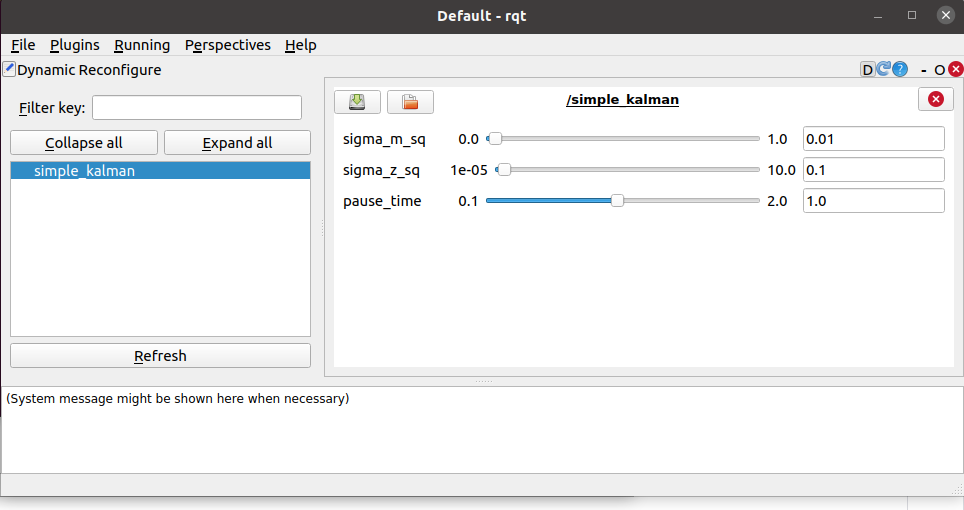

*** UNDER CONSTRUCTION ***


## Today

* Kalman Filter
* Studio Time!

## For Next Time

* Work on your final projects!
* Readings for next Robots and Society discussion: Robots Adding to Economic Inequality  (Pick at least one to read based on your interest).
   * <a-no-proxy href="https://news.mit.edu/2020/how-many-jobs-robots-replace-0504"> How many jobs do robots really replace? </a-no-proxy>
   * <a-no-proxy href="https://news.mit.edu/2020/robots-help-firms-workers-struggle-0505"> Robots help some firms, even while workers across industries struggle </a-no-proxy>
   * <a-no-proxy href="https://hbr.org/2020/10/algorithms-are-making-economic-inequality-worse"> Study finds stronger links between automation and inequality </a-no-proxy>
   * <a-no-proxy href="https://hbr.org/2020/10/algorithms-are-making-economic-inequality-worse"> Algorithms Are Making Economic Inequality Worse </a-no-proxy>
   * <a-no-proxy href="https://www.imf.org/external/pubs/ft/fandd/2016/09/berg.htm"> Robots, Growth, and Inequality </a-no-proxy>

## Kalman Filter

We'll be running through this slide deck ([pptx](https://drive.google.com/file/d/1yVFgAFPqXGgN2F0FlHZPxA7lYgJlGYPF/view?usp=sharing), [PDF](https://drive.google.com/file/d/1vtcSzF_Q7o6PEhUoXCoIfLgYFX_Xs4-_/view?usp=sharing))

Once we've given you the basic ideas, we'll also show you how to run your own simple Kalman filter.  The commands to run the filter are.


First, startup roscore.

```bash
$ roscore
```

In a new terminal, run the following command.
 
```bash
$ rosrun simple_filter simple_kalman.py
```

In a new terminal, run the following command.
```bash
$ rosrun rqt_gui rqt_gui
```

In the ``rqt_gui`` window, go to ``plugins``, ``Visualization``, ``Dynamic Reconfigure``.  You should now have a window that looks like this.



You can use these sliders to control the behavior of the filter.
